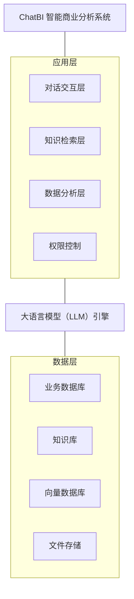
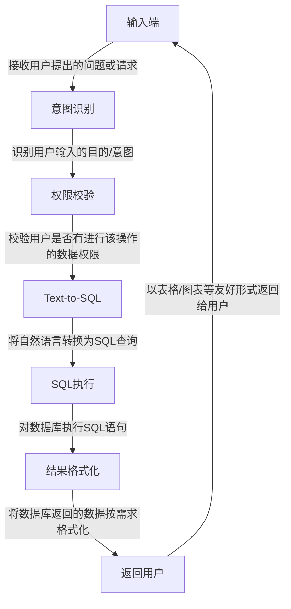

# 民航机场 ChatBI 智能商业分析系统 产品需求文档（PRD）

---

## 文档信息

| 项目 | 内容 |
|------|------|
| 产品名称 | 民航机场 ChatBI 智能商业分析系统 |
| 文档版本 | V1.0 |
| 创建日期 | 2026-02-06 |
| 文档状态 | 初稿 |
| 目标读者 | 产品团队、开发团队、测试团队、项目管理 |

---

## 1. 产品概述

### 1.1 产品背景

民航机场日常运营涉及大量数据分析需求，包括航班运行数据、会员消费数据、商业经营数据、天气预警数据等。当前业务人员获取数据洞察主要依赖 IT 部门编写 SQL 查询或使用复杂的报表工具，存在以下痛点：

- **技术门槛高**：业务人员不具备 SQL 编写能力，无法自主查询数据
- **响应周期长**：数据需求需提交 IT 部门处理，等待时间长
- **专业术语理解困难**：通用 BI 工具无法理解民航专业术语
- **知识检索分散**：规章制度、业务知识分散在各处，查找困难

### 1.2 产品定位

ChatBI 是一款面向民航机场的**智能对话式商业分析平台**，通过自然语言交互方式，让业务人员无需掌握 SQL 或复杂报表工具，即可通过对话快速获取数据洞察、生成可视化报表、检索业务知识。

### 1.3 产品愿景

**"让数据触手可及，让洞察即问即得"**

- 降低数据分析门槛，赋能业务人员自主分析
- 构建机场专属知识库，实现智能问答
- 提升数据驱动决策效率

### 1.4 核心价值主张

| 价值维度 | 描述 |
|----------|------|
| 易用性 | 自然语言交互，零学习成本 |
| 专业性 | 深度理解民航专业术语和业务场景 |
| 安全性 | 严格的数据权限控制，防止越权访问 |
| 高效性 | 即问即答，秒级响应 |

---

## 2. 用户分析

### 2.1 目标用户

| 用户群体 | 机场信息科技部 |
|----------|----------------|
| 用户规模 | 5-10 人 |
| 用户特征 | 具备一定技术背景，熟悉机场业务流程 |
| 使用场景 | 日常数据查询、报表生成、业务分析、知识检索 |

### 2.2 用户画像

**典型用户：信息科技部数据分析员**

- **背景**：了解机场业务，但不精通 SQL
- **痛点**：需要频繁查询各类运营数据，传统方式效率低
- **期望**：通过简单对话快速获取所需数据和报表
- **使用频率**：每日多次

### 2.3 用户场景（User Stories）

| 编号 | 用户故事 | 优先级 |
|------|----------|--------|
| US01 | 作为数据分析员，我希望通过自然语言查询航班信息，以便快速了解航班运行状态 | P0 |
| US02 | 作为数据分析员，我希望系统能理解专业术语（如"准点率"、"延误"），以便准确获取数据 | P0 |
| US03 | 作为数据分析员，我希望能生成可视化图表，以便直观展示数据趋势 | P0 |
| US04 | 作为数据分析员，我希望系统记住对话上下文，以便进行连续追问 | P0 |
| US05 | 作为数据分析员，我希望能保存和管理历史对话，以便后续查阅 | P1 |
| US06 | 作为数据分析员，我希望能收藏常用问题，以便快速复用 | P1 |
| US07 | 作为数据分析员，我希望能上传 Excel/CSV 文件进行分析，以便处理临时数据 | P1 |
| US08 | 作为数据分析员，我希望只能查询权限范围内的数据，以确保数据安全 | P0 |

---

## 3. 功能需求

### 3.1 功能架构图


```
┌─────────────────────────────────────────────────────────────────┐
│                        ChatBI 智能商业分析系统                     │
├─────────────────────────────────────────────────────────────────┤
│  ┌─────────────┐  ┌─────────────┐  ┌─────────────┐  ┌─────────┐ │
│  │  对话交互层   │  │  知识检索层   │  │  数据分析层   │  │ 权限控制 │ │
│  └─────────────┘  └─────────────┘  └─────────────┘  └─────────┘ │
├─────────────────────────────────────────────────────────────────┤
│  ┌─────────────────────────────────────────────────────────────┐ │
│  │                      大语言模型（LLM）引擎                     │ │
│  └─────────────────────────────────────────────────────────────┘ │
├─────────────────────────────────────────────────────────────────┤
│  ┌─────────────┐  ┌─────────────┐  ┌─────────────┐  ┌─────────┐ │
│  │  业务数据库   │  │   知识库     │  │  向量数据库   │  │ 文件存储 │ │
│  └─────────────┘  └─────────────┘  └─────────────┘  └─────────┘ │
└─────────────────────────────────────────────────────────────────┘
```

### 3.2 功能模块详述

#### 3.2.1 智能对话模块（F01）

**功能描述**：提供自然语言交互界面，用户通过对话方式进行数据查询和分析。

| 功能点 | 描述 | 优先级 |
|--------|------|--------|
| F01-01 | 自然语言输入：支持用户以自然语言描述查询需求 | P0 |
| F01-02 | 意图识别：准确识别用户查询意图（数据查询/报表生成/知识检索） | P0 |
| F01-03 | 上下文记忆：单次会话内保持上下文连贯，支持追问和澄清 | P0 |
| F01-04 | 多轮对话：支持基于前文的连续对话，如"按月份细分"、"只看国际航班" | P0 |
| F01-05 | 智能纠错：对用户输入的错别字、模糊表达进行智能理解 | P1 |
| F01-06 | 会话中断：用户强制中断本次会话响应 | P2 |

#### 3.2.2 数据查询与分析模块（F02）

**功能描述**：将自然语言转换为数据库查询，返回结构化数据结果。

| 功能点 | 描述 | 优先级 |
|--------|------|--------|
| F02-01 | Text-to-SQL：将自然语言转换为 SQL 查询语句 | P0 |
| F02-02 | 查询执行：安全执行 SQL 并返回结果 | P0 |
| F02-03 | 结果格式化：以表格形式清晰展示查询结果 | P0 |
| F02-04 | 查询解释：展示生成的 SQL 语句供用户确认（保留） | P2 |

**典型查询示例**：

| 用户输入 | 系统响应 |
|----------|----------|
| 查询航班号CA1519在2025年6月1日的详细信息 | 返回该航班的起降时间、航站楼、状态等信息 |
| 统计过去30天内有过消费记录的活跃会员数量 | 返回活跃会员总数 |
| 找出2月份过生日的所有白名单会员 | 返回符合条件的会员列表 |

#### 3.2.3 可视化报表模块（F03）

**功能描述**：根据用户需求自动生成可视化图表和统计报表。

| 功能点 | 描述 | 优先级 |
|--------|------|--------|
| F03-01 | 智能图表推荐：根据数据特征自动推荐合适的图表类型 | P0 |
| F03-02 | 柱状图/条形图：支持分类数据对比展示 | P0 |
| F03-03 | 折线图：支持趋势数据展示 | P0 |
| F03-04 | 饼图/环形图：支持占比数据展示 | P0 |
| F03-05 | 表格：支持明细数据展示 | P0 |
| F03-06 | 图表交互：支持图表缩放、筛选、下钻 | P1 |
| F03-07 | 图表导出：支持导出为图片或 PDF | P1 |

**预置统计报表**：

**预设问题**

| 报表名称 | 描述 | 数据维度 |
|----------|------|----------|
| 各航空公司航班量和准点率排名 | 分析航空公司运营表现 | 航空公司、航班量、准点率 |
| 延误航班主要原因分析 | 找出延误原因及平均延误时长 | 延误原因、延误时长、航班数 |
| 各航站楼航班量统计 | 了解航站楼繁忙度分布 | 航站楼、航班量、时段 |
| 国内国际航班比例 | 分析航线结构 | 航班类型、数量、占比 |
| 热门目的地城市TOP10 | 发现最受欢迎的航线 | 目的地、航班量、旅客量 |
| VIP会员消费金额TOP100 | 识别高价值客户 | 会员、消费金额、消费次数 |
| 店铺销售额排名 | 分析商业表现 | 店铺、销售额、订单数 |
| 会员年龄段分布 | 了解客户群体结构 | 年龄段、会员数、占比 |
| 会员消费时段偏好 | 分析消费行为习惯 | 时段、消费金额、订单数 |

#### 3.2.4 元数据模块（F04）

**功能描述**：构建机场专属知识库，支持专业术语理解和规章制度检索。

| 功能点 | 描述 | 优先级 |
|--------|------|--------|
| F04-01 | 专业术语库：内置民航专业术语解释和同义词映射 | P0 |
| F04-03 | 静态数据查询：支持查询机场基础配置数据 | P0 |
| F04-05 | 知识库管理：支持管理员维护和更新知识库内容 | P2 |

**专业术语示例**：

| 术语 | 解释 | 同义词 |
|------|------|--------|
| 准点率 | 航班实际起飞/到达时间与计划时间偏差在15分钟内的比例 | 正点率、OTP |
| 延误 | 航班实际起飞/到达时间晚于计划时间15分钟以上 | 晚点 |
| 航站楼 | 机场旅客候机和登机的建筑设施 | T1、T2、Terminal |
| 白名单会员 | 享有特殊权益的VIP会员 | 贵宾会员 |

#### 3.2.5 会话管理模块（F05）

**功能描述**：提供对话的创建、保存、历史查看和删除功能。

| 功能点 | 描述 | 优先级 |
|--------|------|--------|
| F05-01 | 新建对话：创建新的对话会话 | P0 |
| F05-02 | 保存对话：自动保存对话历史记录 | P0 |
| F05-03 | 历史对话列表：展示用户的历史对话列表 | P0 |
| F05-04 | 对话搜索：支持按关键词搜索历史对话 | P1 |
| F05-05 | 删除对话：支持删除单个或批量删除对话 | P0 |
| F05-06 | 对话重命名：支持自定义对话标题 | P2 |

#### 3.2.6 常用问题收藏模块（F06）

**功能描述**：支持用户收藏常用问题，实现快速复用。

| 功能点 | 描述 | 优先级 |
|--------|------|--------|
| F06-01 | 收藏问题：将当前问题添加到收藏夹 | P1 |
| F06-02 | 收藏夹管理：查看、编辑、删除收藏的问题 | P1 |
| F06-03 | 快速查询：点击收藏问题直接执行查询 | P1 |
| F06-04 | 收藏分类：支持对收藏问题进行分类管理 | P2 |

#### 3.2.7 文件上传分析模块（F07）（低优先级）

**功能描述**：支持用户上传 Excel/CSV 文件，基于上传数据进行分析。

| 功能点 | 描述 | 优先级 |
|--------|------|--------|
| F07-01 | 文件上传：支持上传 Excel（.xlsx/.xls）和 CSV 文件 | P1 |
| F07-02 | 文件解析：自动解析文件结构和数据类型 | P1 |
| F07-03 | 数据预览：上传后展示数据预览 | P1 |
| F07-04 | 文件选择：支持在对话中选择已上传的文件进行分析 | P1 |
| F07-05 | 文件数据查询：基于上传文件数据进行自然语言查询 | P1 |
| F07-06 | 文件管理：查看、删除已上传的文件 | P1 |

**文件限制**：

| 限制项 | 限制值 |
|--------|--------|
| 单文件大小上限 | 10 MB |
| 单文件行数上限 | 100,000 行 |
| 支持格式 | .xlsx, .xls, .csv |
| 文件保留期限 | 7 天（可配置） |

#### 3.2.8 权限控制模块（F08）

**功能描述**：实现基于部门的数据权限控制，防止越权查询。

| 功能点 | 描述 | 优先级 |
|--------|------|--------|
| F08-01 | 用户认证：支持用户登录认证 | P1 |
| F08-02 | 部门绑定：用户与部门关联 | P1 |
| F08-03 | 数据权限配置：配置各部门可访问的数据表和字段 | P1 |
| F08-04 | 查询权限校验：执行查询前校验用户权限 | P1 |
| F08-05 | 越权拦截：拦截并提示越权查询请求 | P1 |
| F08-06 | 权限审计日志：记录用户查询行为供审计 | P0 |

**权限控制规则**：

| 规则 | 描述 |
|------|------|
| 行级权限 | 用户只能查询本部门相关的数据行 |
| 列级权限 | 敏感字段（如会员手机号）按权限脱敏或隐藏 |
| 表级权限 | 部分数据表仅特定部门可访问 |
| 操作权限 | 区分查询、导出、管理等操作权限 |

---

## 4. 非功能需求

### 4.1 性能需求

| 指标 | 要求 |
|------|------|
| 响应时间 | 简单查询 ≤ 10 秒，复杂查询 ≤ 30 秒 |
| 并发用户 | 支持 10 个用户同时在线 |
| 系统可用性 | ≥ 99.5%（工作时间） |
| 数据刷新频率 | 航班数据实时同步，其他数据 T+1 |

### 4.2 安全需求

| 需求项 | 描述 |
|--------|------|
| 身份认证 | 支持用户名密码登录，可对接企业统一认证 |
| 数据传输 | 全程 HTTPS 加密传输 |
| SQL 注入防护 | 严格参数化查询，SQL校验 |
| 敏感数据保护 | 敏感字段脱敏处理（如手机号、身份证号） |
| 操作审计 | 记录用户所有查询操作日志 |
| 会话管理 | 支持会话超时自动登出 |

### 4.3 兼容性需求

| 需求项 | 描述 |
|--------|------|
| 浏览器支持 | Chrome 90+、Edge 90+、Firefox 88+ |
| 分辨率支持 | 最低 1366×768，推荐 1920×1080 |
| 移动端 | 暂不支持，后续版本考虑 |

### 4.4 可维护性需求

| 需求项 | 描述 |
|--------|------|
| 日志记录 | 完整的系统运行日志和错误日志 |
| 监控告警 | 支持系统异常告警通知 |
| 配置管理 | 关键参数支持配置化，无需重新部署 |

---

## 5. 数据需求

### 5.1 数据源概览

| 数据分类 | 表数量 | 主要内容 |
|----------|--------|----------|
| 航班数据 | - | 航班计划、实际起降、延误信息、航空公司等 |
| 机场资源数据 | - | 航站楼、登机口、值机柜台、停机位等 |
| 天气数据 | - | 天气预报、气象预警、能见度等 |
| 会员数据 | - | 会员基本信息、等级、积分等 |
| 会员订单数据 | - | 消费记录、订单明细、支付信息等 |
| 店铺数据 | - | 店铺信息、商品、销售统计等 |
| **合计** | **41** | - |

### 5.2 核心数据实体

#### 5.2.1 航班数据

| 字段 | 说明 | 示例 |
|------|------|------|
| 航班号 | 航班唯一标识 | CA1519 |
| 航空公司 | 承运航空公司 | 中国国航 |
| 出发地 | 起飞机场 | 北京首都 |
| 目的地 | 到达机场 | 广州白云 |
| 计划起飞时间 | 预定起飞时间 | 2025-06-01 08:00 |
| 实际起飞时间 | 实际起飞时间 | 2025-06-01 08:15 |
| 航班状态 | 当前状态 | 已起飞/延误/取消 |
| 航站楼 | 所在航站楼 | T2 |
| 登机口 | 登机口编号 | A12 |

#### 5.2.2 会员数据

| 字段 | 说明 | 示例 |
|------|------|------|
| 会员ID | 会员唯一标识 | M00012345 |
| 姓名 | 会员姓名 | 张三 |
| 手机号 | 联系电话（脱敏） | 138****1234 |
| 会员等级 | VIP等级 | 金卡/银卡/普通 |
| 生日 | 出生日期 | 1990-02-15 |
| 注册时间 | 入会时间 | 2023-01-01 |
| 累计消费 | 历史消费总额 | 12580.00 |
| 白名单标识 | 是否白名单会员 | 是/否 |

#### 5.2.3 天气预警数据

| 字段 | 说明 | 示例 |
|------|------|------|
| 预警ID | 预警唯一标识 | W20250601001 |
| 省份 | 预警所在省份 | 广东省 |
| 预警类型 | 预警类别 | 暴雨/台风/高温 |
| 预警级别 | 预警等级 | 红色/橙色/黄色/蓝色 |
| 发布时间 | 预警发布时间 | 2025-06-01 10:00 |
| 生效状态 | 是否生效中 | 生效/已解除 |

---

## 6. 界面设计

### 6.1 页面结构

```
┌────────────────────────────────────────────────────────────────┐
│  顶部导航栏：Logo | 用户信息 | 设置                    │
├──────────────┬─────────────────────────────────────────────────┤
│              │                                                 │
│  左侧边栏     │              主对话区域                          │
│  - 新建对话   │                                                 │
│  - 历史对话   │  ┌─────────────────────────────────────────┐   │
│  - 收藏问题   │  │  对话消息展示区                            │   │
│  - 上传文件   │  │  - 用户问题                               │   │
│              │  │  - AI 回答（文本/表格/图表）                │   │
│              │  └─────────────────────────────────────────┘   │
│              │                                                │
│              │  ┌─────────────────────────────────────────┐   │
│              │  │  输入框 | 发送按钮 | 上传按钮               │   │
│              │  └─────────────────────────────────────────┘   │
└──────────────┴─────────────────────────────────────────────────┘
```

### 6.2 核心页面说明

#### 6.2.1 对话主页面

| 元素 | 说明 |
|------|------|
| 对话消息区 | 展示用户问题和 AI 回答，支持滚动浏览 |
| 输入框 | 支持多行输入，Enter 发送，Shift+Enter 换行 |
| 发送按钮 | 提交用户问题 |
| 上传按钮 | 上传 Excel/CSV 文件 |
| 收藏按钮 | 收藏当前问题 |

#### 6.2.2 数据结果展示

| 展示类型 | 适用场景 |
|----------|----------|
| 表格 | 明细数据查询结果 |
| 柱状图 | 分类对比数据 |
| 折线图 | 趋势变化数据 |
| 饼图 | 占比分布数据 |
| 数字卡片 | 单一统计指标 |

---

## 7. 技术架构建议

### 7.1 系统架构图



### 7.2 技术选型建议

| 层级 | 技术选项 | 说明 |
|------|----------|------|
| 前端 | Vue 3 | 现代前端框架，组件化开发 |
| 图表库 | ECharts / AntV | 丰富的可视化图表支持 |
| 后端 | LangGraph ，FastAPI | SQL 生成需要“自我反思”（生成 SQL -> 发现语法错 -> 修正 -> 再执行），LangGraph 的状态管理能力比单纯的 Chain 更强 |
| LLM | 本地部署 | Text-to-SQL 核心能力 |
| 向量数据库 | Milvus / Pinecone | 知识库语义检索 |
| 缓存 | Redis | 会话缓存、查询缓存 |
| 数据库 | MySQL / 达梦 | 业务数据存储 |

### 7.3 核心流程

#### 7.3.1 自然语言查询流程



## 8. 风险与约束

### 8.1 项目风险

| 风险 | 影响 | 应对措施 |
|------|------|----------|
| Text-to-SQL 准确率不足 | 查询结果错误 | 增加 Few-shot 示例，持续优化 Prompt |
| LLM 响应延迟 | 用户体验差 | 引入缓存机制，优化 Prompt 长度 |
| 数据权限泄露 | 安全事故 | 严格权限校验，SQL 审计 |
| 专业术语理解偏差 | 查询意图误判 | 构建完善的术语库和同义词映射 |

### 8.2 项目约束

| 约束类型 | 描述 |
|----------|------|
| 用户规模 | 当前仅 5-10 人使用，系统设计按小规模优化 |
| 数据范围 | 仅限 41 张业务表，不涉及外部数据源 |
| 部署环境 | 需部署在机场内网环境 |
| 合规要求 | 需符合民航数据安全相关规定 |

---

## 9. 版本规划

### 9.1 MVP（最小可行产品）

**目标**：验证核心价值，快速上线

| 功能 | 优先级 |
|------|--------|
| 自然语言数据查询（Text-to-SQL） | P0 |
| 基础图表生成 | P0 |
| 上下文记忆 | P0 |
| 会话管理（新建/保存/删除） | P0 |
| 用户认证与基础权限控制 | P0 |

### 9.2 V1.0 正式版

**目标**：功能完善，满足日常使用

| 功能 | 优先级 |
|------|--------|
| MVP 全部功能 | P0 |
| 知识库检索（专业术语、规章制度） | P0 |
| 常用问题收藏 | P1 |
| 文件上传分析 | P1 |
| 数据导出 | P1 |
| 完善的权限控制 | P0 |

### 9.3 V2.0 增强版

**目标**：体验优化，功能扩展

| 功能 | 优先级 |
|------|--------|
| 智能图表推荐 | P1 |
| 图表交互（下钻、筛选） | P1 |
| 知识库管理后台 | P2 |

---

## 10. 附录

### 10.1 术语表

| 术语 | 英文 | 解释 |
|------|------|------|
| ChatBI | Chat Business Intelligence | 基于对话的商业智能分析 |
| Text-to-SQL | - | 将自然语言转换为 SQL 查询语句的技术 |
| LLM | Large Language Model | 大语言模型 |
| RAG | Retrieval-Augmented Generation | 检索增强生成，结合知识库的 AI 问答技术 |
| 准点率 | On-Time Performance (OTP) | 航班按时起降的比例 |

---

**文档结束**

