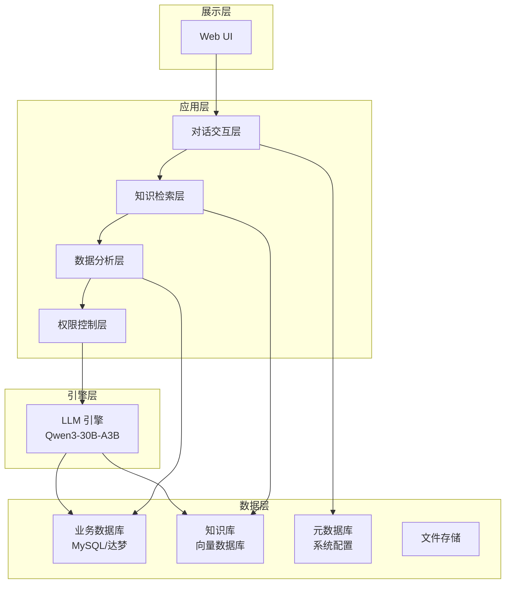
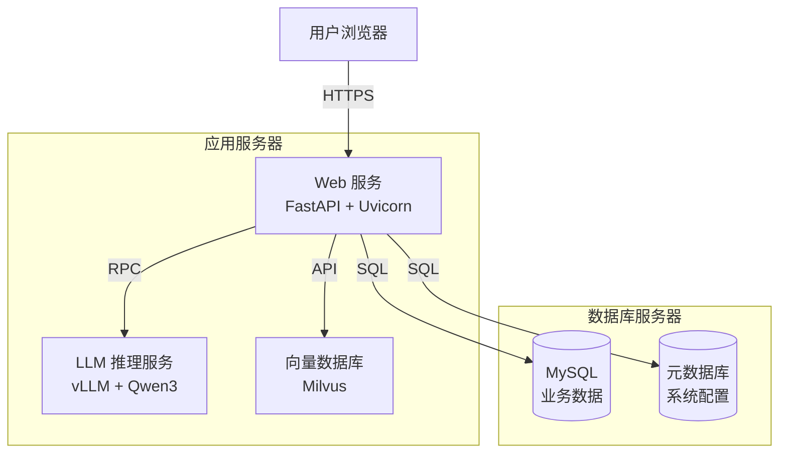
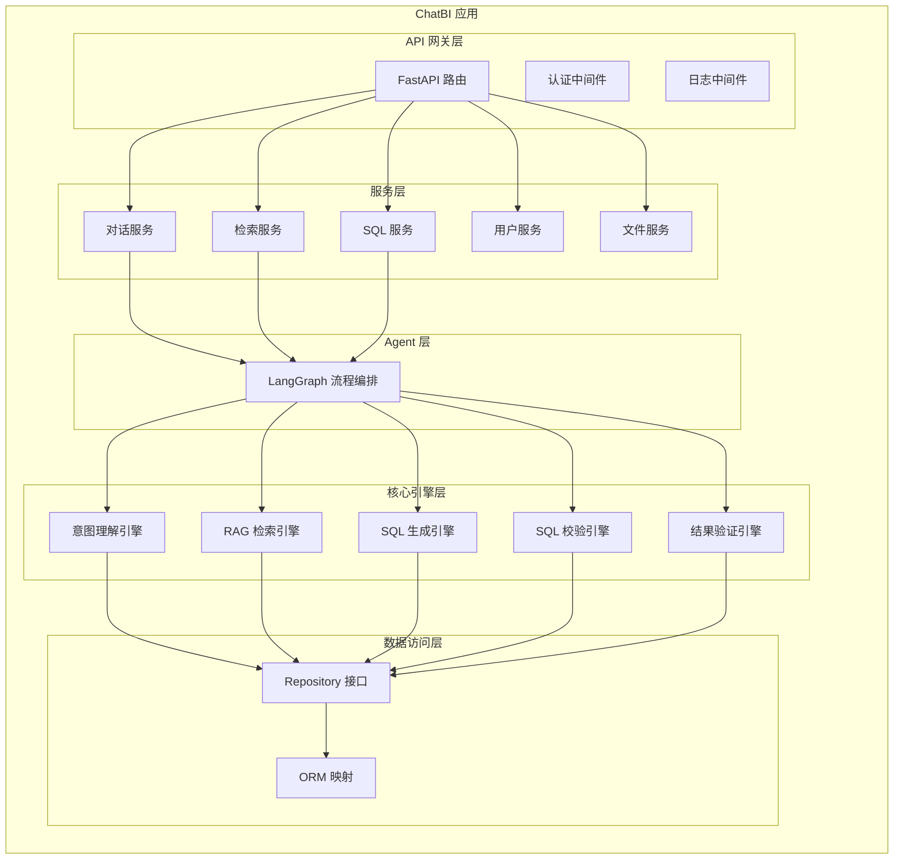
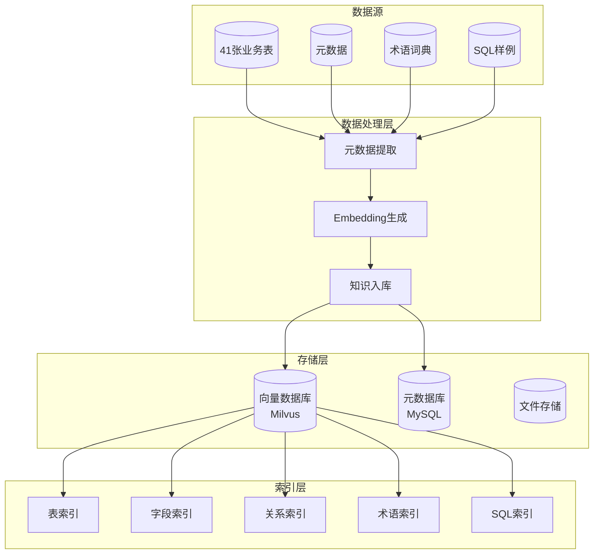
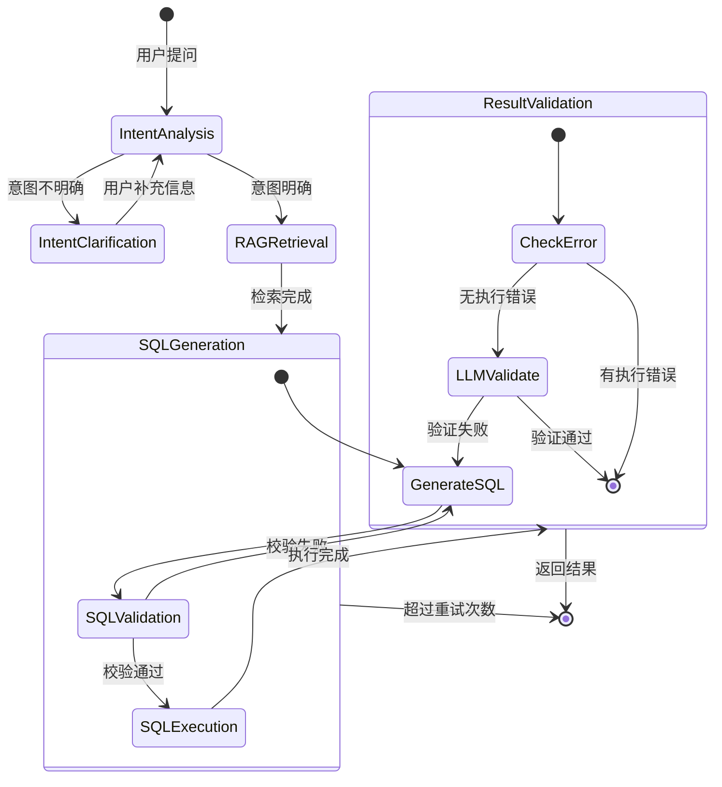
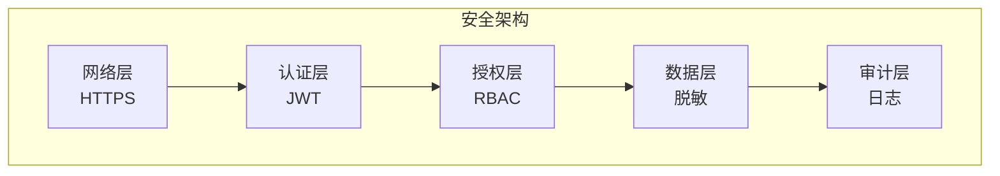
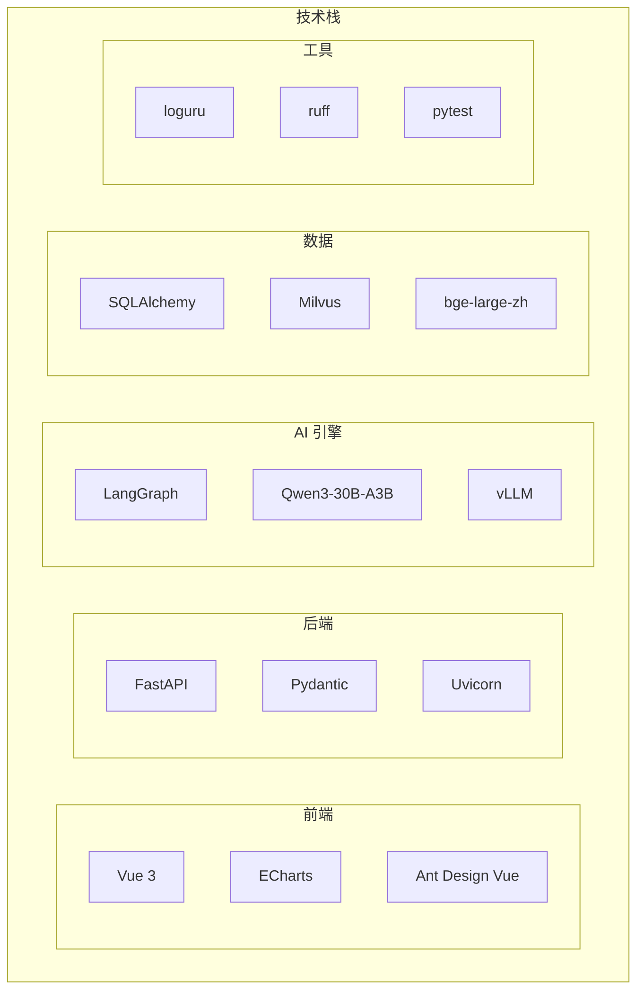

# 民航机场 ChatBI 智能商业分析系统 架构设计文档

---

## 文档信息

| 项目 | 内容 |
|------|------|
| 项目名称 | 民航机场 ChatBI 智能商业分析系统 |
| 文档版本 | V1.0 |
| 创建日期 | 2026-02-11 |
| 文档状态 | 初稿 |
| 目标读者 | 架构师、技术负责人、开发团队 |

---

## 1. 架构概述

### 1.1 系统定位

ChatBI 是一款面向民航机场的**智能对话式商业分析平台**，采用 Text2SQL 技术路线，通过自然语言交互方式，让业务人员无需掌握 SQL 即可快速获取数据洞察。

### 1.2 架构目标

| 目标 | 说明 |
|------|------|
| **数据不出域** | 所有组件本地部署，满足民航数据安全要求 |
| **高准确率** | SQL 执行成功率 ≥ 85%，结果正确率 ≥ 80% |
| **低延迟** | 简单查询 ≤ 10 秒，复杂查询 ≤ 30 秒 |
| **可扩展** | 支持达梦数据库扩展，支持知识库动态更新 |
| **可维护** | 模块化设计，组件职责清晰 |

### 1.3 架构原则

| 原则 | 说明 |
|------|------|
| 分层解耦 | 应用层、引擎层、数据层清晰分离 |
| 单一职责 | 每个模块专注于特定功能 |
| 开放封闭 | 对扩展开放，对修改封闭 |
| 依赖倒置 | 高层模块不依赖低层模块，都依赖抽象 |
| 接口隔离 | 客户端不应依赖它不需要的接口 |

---

## 2. 架构原则与约束

### 2.1 业务约束

| 约束类型 | 描述 |
|----------|------|
| 用户规模 | 5-10 人（机场信息科技部） |
| 数据范围 | 41 张民航业务表 |
| 部署环境 | 机场内网环境 |
| 合规要求 | 符合民航数据安全相关规定 |
| 数据不出域 | 禁止使用外部 API（如 OpenAI） |

### 2.2 技术约束

| 约束类型 | 描述 |
|----------|------|
| 数据库 | 支持 MySQL 8.0+，预留达梦数据库接口 |
| Python 版本 | 3.13+ |
| GPU 显存 | 单卡 24GB-48GB |
| 并发用户 | 支持 10 个用户同时在线 |

### 2.3 非功能性约束

| 约束类型 | 要求 |
|----------|------|
| 系统可用性 | ≥ 99.5%（工作时间） |
| 响应时间 | 简单查询 ≤ 10 秒，复杂查询 ≤ 30 秒 |
| 数据刷新 | 航班数据实时同步，其他数据 T+1 |

---

## 3. 系统架构设计

### 3.1 逻辑架构



### 3.2 分层说明

| 层次 | 职责 | 核心组件 |
|------|------|----------|
| **展示层** | 用户界面、交互 | Web UI（Vue 3 + ECharts） |
| **应用层** | 业务逻辑处理 | 对话交互、知识检索、数据分析、权限控制 |
| **引擎层** | AI 推理能力 | LLM 引擎（Qwen3 + vLLM） |
| **数据层** | 数据存储与检索 | 业务数据库、向量数据库、元数据库 |

### 3.3 部署架构



---

## 4. 应用架构设计

### 4.1 模块划分



### 4.2 核心模块说明

#### 4.2.1 对话交互模块（ChatService）

| 功能 | 说明 |
|------|------|
| 会话管理 | 创建、查询、删除会话 |
| 消息管理 | 保存、查询历史消息 |
| 上下文管理 | 维护多轮对话上下文 |
| 流式输出 | 支持 SSE 流式返回 |

#### 4.2.2 检索服务模块（RetrievalService）

| 功能 | 说明 |
|------|------|
| 表级检索 | 根据问题检索相关表（Top-5） |
| 字段检索 | 根据问题检索相关字段（Top-15） |
| 关系检索 | 查找表间 JOIN 关系 |
| 术语检索 | 检索业务术语解释 |
| 样例检索 | 检索黄金 SQL 样例 |

#### 4.2.3 SQL 服务模块（SQLService）

| 功能 | 说明 |
|------|------|
| SQL 生成 | 基于 LLM 生成 SQL |
| SQL 校验 | 四层校验机制 |
| SQL 执行 | 安全执行 SQL 查询 |
| 结果验证 | 验证结果正确性 |

#### 4.2.4 用户服务模块（UserService）

| 功能 | 说明 |
|------|------|
| 用户认证 | 登录、登出、Token 验证 |
| 权限管理 | 基于部门的数据权限控制 |
| 收藏管理 | 常用问题收藏 |
| 审计日志 | 记录用户操作 |

#### 4.2.5 文件服务模块（FileService）

| 功能 | 说明 |
|------|------|
| 文件上传 | 支持 Excel/CSV 上传 |
| 文件解析 | 解析文件结构 |
| 文件管理 | 查看、删除已上传文件 |
| 临时存储 | 7 天自动清理 |

---

## 5. 数据架构设计

### 5.1 数据架构全景



### 5.2 元数据知识库设计

#### 5.2.1 知识库分层

```
┌─────────────────────────────────────────────────────────────────┐
│                      五层元数据知识库                            │
├─────────────────────────────────────────────────────────────────┤
│                                                                 │
│  Layer 1: 表级元数据 (Table Metadata)                            │
│  ├─ 表名 (table_name)                                           │
│  ├─ 表注释 (table_comment)                                      │
│  ├─ 业务描述 (business_description)                             │
│  ├─ 所属领域 (domain)                                           │
│  ├─ 关键词 (keywords)                                           │
│  ├─ 相关表 (related_tables)                                     │
│  └─ 常见查询 (common_queries)                                   │
│                                                                 │
│  Layer 2: 字段级元数据 (Column Metadata)                         │
│  ├─ 字段名 (column_name)                                        │
│  ├─ 字段类型 (column_type)                                      │
│  ├─ 字段注释 (column_comment)                                   │
│  ├─ 业务含义 (business_meaning)                                 │
│  ├─ 枚举值 (enum_values)                                        │
│  ├─ 同义词 (synonyms)                                           │
│  └─ 示例值 (sample_values)                                      │
│                                                                 │
│  Layer 3: 关系元数据 (Relationship Metadata)                     │
│  ├─ 父表 (parent_table)                                         │
│  ├─ 子表 (child_table)                                          │
│  ├─ 关联类型 (relationship_type)                                │
│  ├─ JOIN 条件 (join_condition)                                  │
│  └─ 额外条件 (additional_condition)                             │
│                                                                 │
│  Layer 4: 业务术语词典 (Business Glossary)                       │
│  ├─ 术语名称 (term)                                             │
│  ├─ 别名 (aliases)                                              │
│  ├─ 定义 (definition)                                           │
│  ├─ 关联表 (related_tables)                                     │
│  └─ 关联字段 (related_columns)                                  │
│                                                                 │
│  Layer 5: 黄金 SQL 样例库 (Golden SQL Examples)                 │
│  ├─ 问题模板 (question_template)                                │
│  ├─ 问题示例 (question_examples)                                │
│  ├─ SQL 模板 (sql_template)                                     │
│  ├─ 查询模式 (query_pattern)                                    │
│  └─ 涉及表 (involved_tables)                                    │
│                                                                 │
└─────────────────────────────────────────────────────────────────┘
```

#### 5.2.2 向量索引设计

| 索引名称 | 向量维度 | 索引类型 | 说明 |
|----------|----------|----------|------|
| table_index | 1024 | IVF_FLAT | 表级语义检索 |
| column_index | 1024 | IVF_FLAT | 字段级语义检索 |
| sql_index | 1024 | IVF_FLAT | SQL 样例检索 |
| glossary_index | 1024 | IVF_FLAT | 术语词典检索 |

### 5.3 业务数据库设计

#### 5.3.1 核心表设计

**会话表（chat_sessions）**

```sql
CREATE TABLE chat_sessions (
    id VARCHAR(36) PRIMARY KEY COMMENT '会话ID（UUID）',
    user_id VARCHAR(50) NOT NULL COMMENT '用户ID',
    title VARCHAR(200) COMMENT '会话标题',
    created_at TIMESTAMP DEFAULT CURRENT_TIMESTAMP COMMENT '创建时间',
    updated_at TIMESTAMP DEFAULT CURRENT_TIMESTAMP ON UPDATE CURRENT_TIMESTAMP COMMENT '更新时间',
    INDEX idx_user_id (user_id),
    INDEX idx_updated_at (updated_at)
) COMMENT='对话会话表';
```

**消息表（chat_messages）**

```sql
CREATE TABLE chat_messages (
    id VARCHAR(36) PRIMARY KEY COMMENT '消息ID（UUID）',
    session_id VARCHAR(36) NOT NULL COMMENT '会话ID',
    role ENUM('user', 'assistant', 'system') NOT NULL COMMENT '角色',
    content TEXT NOT NULL COMMENT '消息内容',
    metadata JSON COMMENT '元数据（SQL、执行时间等）',
    created_at TIMESTAMP DEFAULT CURRENT_TIMESTAMP COMMENT '创建时间',
    INDEX idx_session_id (session_id),
    INDEX idx_created_at (created_at),
    FOREIGN KEY (session_id) REFERENCES chat_sessions(id) ON DELETE CASCADE
) COMMENT='对话消息表';
```

**用户收藏表（user_favorites）**

```sql
CREATE TABLE user_favorites (
    id VARCHAR(36) PRIMARY KEY COMMENT '收藏ID（UUID）',
    user_id VARCHAR(50) NOT NULL COMMENT '用户ID',
    question TEXT NOT NULL COMMENT '问题内容',
    category VARCHAR(50) COMMENT '分类',
    created_at TIMESTAMP DEFAULT CURRENT_TIMESTAMP COMMENT '创建时间',
    INDEX idx_user_id (user_id),
    INDEX idx_category (category)
) COMMENT='用户收藏表';
```

**查询日志表（query_logs）**

```sql
CREATE TABLE query_logs (
    id VARCHAR(36) PRIMARY KEY COMMENT '日志ID（UUID）',
    user_id VARCHAR(50) NOT NULL COMMENT '用户ID',
    question TEXT NOT NULL COMMENT '用户问题',
    generated_sql TEXT COMMENT '生成的SQL',
    execution_time FLOAT COMMENT '执行时间（秒）',
    row_count INT COMMENT '返回行数',
    is_success BOOLEAN DEFAULT FALSE COMMENT '是否成功',
    error_message TEXT COMMENT '错误信息',
    retry_count INT DEFAULT 0 COMMENT '重试次数',
    created_at TIMESTAMP DEFAULT CURRENT_TIMESTAMP COMMENT '创建时间',
    INDEX idx_user_id (user_id),
    INDEX idx_created_at (created_at),
    INDEX idx_is_success (is_success)
) COMMENT='查询审计日志表';
```

---

## 6. 核心流程设计

### 6.1 Text2SQL 核心流程



### 6.2 LangGraph 状态设计

```python
from typing import TypedDict, List, Optional, Literal
from typing_extensions import Annotated

class ChatBIState(TypedDict):
    """ChatBI 核心状态定义"""

    # ===== 输入 =====
    user_question: str                    # 用户问题
    session_id: str                       # 会话ID
    user_id: str                          # 用户ID

    # ===== 意图理解 =====
    intent_clear: bool                    # 意图是否明确
    intent: Optional[dict]                # 解析后的意图
    clarification_needed: bool            # 是否需要澄清
    clarification_questions: List[str]    # 澄清问题列表

    # ===== RAG 检索 =====
    retrieved_tables: List[dict]          # 检索到的表
    retrieved_columns: List[dict]         # 检索到的字段
    retrieved_relations: List[dict]       # 检索到的关系
    retrieved_glossary: List[dict]        # 检索到的术语
    retrieved_sql_examples: List[dict]    # 检索到的SQL样例

    # ===== SQL 生成 =====
    generated_sql: Optional[str]          # 生成的SQL
    sql_generation_count: int             # 生成次数计数器

    # ===== SQL 校验 =====
    sql_validation_result: Optional[dict] # 校验结果
    validation_errors: List[str]          # 校验错误列表

    # ===== SQL 执行 =====
    execution_result: Optional[dict]      # 执行结果

    # ===== 结果验证 =====
    result_validation_result: Optional[dict]  # 结果验证结果

    # ===== 输出 =====
    answer: Optional[str]                 # 最终回答
    next_step: Literal[                   # 下一步
        "intent_analysis",
        "clarification",
        "rag_retrieval",
        "sql_generation",
        "sql_validation",
        "sql_execution",
        "result_validation",
        "done",
        "error"
    ]
```

### 6.3 节点定义

| 节点名称 | 输入状态 | 输出状态 | 说明 |
|----------|----------|----------|------|
| intent_understanding_node | user_question | intent, intent_clear | 意图理解 |
| clarification_node | clarification_questions | - | 生成澄清问题 |
| rag_retrieval_node | intent | retrieved_* | RAG 检索 |
| sql_generation_node | intent, retrieved_* | generated_sql | SQL 生成 |
| sql_validation_node | generated_sql | sql_validation_result | SQL 校验 |
| sql_execution_node | generated_sql | execution_result | SQL 执行 |
| result_validation_node | execution_result | result_validation_result | 结果验证 |

---

## 7. 接口设计

### 7.1 API 风格

采用 RESTful API 风格，统一响应格式：

```json
{
  "code": 0,
  "message": "success",
  "data": {...},
  "timestamp": 1234567890
}
```

### 7.2 核心 API 定义

#### 7.2.1 问答接口

```http
POST /api/v1/chat/query
Content-Type: application/json
Authorization: Bearer {token}

{
  "session_id": "uuid",
  "question": "查询航班号CA1519在2025年6月1日的详细信息",
  "stream": false
}
```

#### 7.2.2 会话管理

```http
GET /api/v1/chat/sessions
POST /api/v1/chat/sessions
DELETE /api/v1/chat/sessions/{id}
GET /api/v1/chat/sessions/{id}/messages
```

#### 7.2.3 用户认证

```http
POST /api/v1/auth/login
{
  "username": "user",
  "password": "pass"
}
```

#### 7.2.4 文件上传

```http
POST /api/v1/files/upload
Content-Type: multipart/form-data

file: <binary>
```

---

## 8. 安全架构设计

### 8.1 安全分层



### 8.2 认证设计

采用 JWT（JSON Web Token）认证：

| 组件 | 说明 |
|------|------|
| Token 类型 | JWT (RS256 签名) |
| 有效期 | 8 小时 |
| 刷新机制 | 支持刷新 Token |
| 存储位置 | HttpOnly Cookie |

### 8.3 权限控制设计

#### 8.3.1 多层权限控制

| 层级 | 控制粒度 | 说明 |
|------|----------|------|
| 行级权限 | 数据行级别 | 用户只能查询本部门相关数据 |
| 列级权限 | 字段级别 | 敏感字段脱敏或隐藏 |
| 表级权限 | 表级别 | 部分表仅特定部门可访问 |
| 操作权限 | 操作级别 | 区分查询、导出、管理操作 |

#### 8.3.2 SQL 安全校验

四层校验机制确保 SQL 安全：

| 层级 | 校验内容 | 方法 |
|------|----------|------|
| 第1层 | 语法校验 | sqlglot 解析 |
| 第2层 | 元数据校验 | 表名、字段名白名单 |
| 第3层 | 安全校验 | 禁止非 SELECT 操作 |
| 第4层 | Dry-run | EXPLAIN / LIMIT 0 |

### 8.4 敏感数据保护

| 数据类型 | 保护措施 |
|----------|----------|
| 手机号 | 中间4位脱敏（138****1234） |
| 身份证号 | 中间10位脱敏 |
| 密码 | bcrypt 哈希存储 |
| API Token | 加密存储 |

### 8.5 审计日志

记录所有敏感操作：

| 操作类型 | 记录内容 |
|----------|----------|
| 用户登录 | 用户ID、时间、IP |
| SQL查询 | 用户ID、SQL、执行时间、返回行数 |
| 数据导出 | 用户ID、导出内容、时间 |
| 权限变更 | 操作者、变更内容、时间 |

---

## 9. 性能与扩展性设计

### 9.1 性能优化策略

| 层面 | 策略 | 说明 |
|------|------|------|
| LLM 推理 | vLLM 加速 | 连续批处理、PagedAttention |
| 向量检索 | 索引优化 | IVF_FLAT 索引，Top-K 检索 |
| 数据库查询 | 连接池 | SQLAlchemy 连接池 |
| API 响应 | 异步处理 | FastAPI + aiomysql |
| 前端渲染 | 虚拟滚动 | 大数据量表格优化 |

### 9.2 缓存设计

| 缓存类型 | 缓存内容 | 过期时间 |
|----------|----------|----------|
| 元数据缓存 | 表结构、字段信息 | 1 小时 |
| 术语缓存 | 业务术语映射 | 1 小时 |
| 查询缓存 | 常见查询结果 | 5 分钟 |
| 用户缓存 | 用户权限信息 | 30 分钟 |

### 9.3 扩展性设计

#### 9.3.1 数据库扩展

支持多种数据库类型：

```python
# 数据库抽象层
class DatabaseAdapter(ABC):
    @abstractmethod
    def connect(self) -> Connection:
        pass

    @abstractmethod
    def execute(self, sql: str) -> Result:
        pass

class MySQLAdapter(DatabaseAdapter):
    # MySQL 实现

class DMAdapter(DatabaseAdapter):
    # 达梦数据库实现（预留）
```

#### 9.3.2 模型扩展

支持多种 LLM：

```python
class LLMProvider(ABC):
    @abstractmethod
    def generate(self, prompt: str) -> str:
        pass

class QwenLLM(LLMProvider):
    # Qwen 实现

class LocalLLM(LLMProvider):
    # 本地模型实现
```

---

## 10. 监控与运维设计

### 10.1 监控指标

#### 10.1.1 系统指标

| 指标 | 说明 | 告警阈值 |
|------|------|----------|
| CPU 使用率 | 服务器 CPU 占用 | > 80% |
| 内存使用率 | 服务器内存占用 | > 85% |
| GPU 使用率 | GPU 计算占用 | > 90% |
| GPU 显存 | GPU 内存占用 | > 90% |

#### 10.1.2 应用指标

| 指标 | 说明 | 告警阈值 |
|------|------|----------|
| 请求响应时间 | API 响应耗时 | P95 > 30s |
| 请求成功率 | 成功请求比例 | < 95% |
| SQL 执行成功率 | SQL 可执行比例 | < 80% |
| SQL 结果正确率 | 结果正确比例 | < 75% |

#### 10.1.3 业务指标

| 指标 | 说明 |
|------|------|
| 日活跃用户 | 每日活跃用户数 |
| 日查询量 | 每日查询总次数 |
| 平均查询时长 | 平均每次查询耗时 |
| 热门查询 TOP10 | 查询频率最高的问题 |

### 10.2 日志设计

#### 10.2.1 日志级别

| 级别 | 用途 | 示例 |
|------|------|------|
| DEBUG | 调试信息 | 函数入参、中间变量 |
| INFO | 关键操作 | 用户登录、查询执行 |
| WARNING | 警告信息 | 重试发生、性能下降 |
| ERROR | 错误信息 | SQL 执行失败、异常 |

#### 10.2.2 日志格式

```json
{
  "timestamp": "2026-02-11T10:30:00Z",
  "level": "INFO",
  "service": "chatbi-api",
  "user_id": "user123",
  "session_id": "session456",
  "action": "query",
  "question": "查询航班CA1519",
  "sql": "SELECT * FROM ...",
  "execution_time": 1.5,
  "row_count": 10,
  "status": "success"
}
```

### 10.3 运维工具

| 工具 | 用途 |
|------|------|
| loguru | 结构化日志 |
| Prometheus | 指标收集 |
| Grafana | 指标可视化 |
| LangFuse | LLM 调用追踪 |

---

## 11. 技术架构

### 11.1 技术栈总览



### 11.2 技术选型决策表

| 技术点 | 选项A | 选项B | 选择 | 理由 |
|--------|-------|-------|------|------|
| AI 框架 | LangChain | LangGraph | LangGraph | 复杂状态流、自我反思循环 |
| LLM | Qwen2.5-14B | Qwen3-30B-A3B | Qwen3-30B-A3B | MoE 架构，高性价比 |
| 推理框架 | transformers | vLLM | vLLM | 20-30倍加速 |
| 向量库 | Chroma | Milvus | Milvus | 生产级，独立部署 |
| Web 框架 | Flask | FastAPI | FastAPI | 原生异步、自动文档 |
| SQL 工具 | sqlparse | sqlglot | sqlglot | 多方言支持 |

---

## 12. 附录

### 12.1 核心术语表

| 术语 | 英文 | 解释 |
|------|------|------|
| ChatBI | Chat Business Intelligence | 基于对话的商业智能分析 |
| Text2SQL | Text to SQL | 将自然语言转换为 SQL 查询 |
| RAG | Retrieval-Augmented Generation | 检索增强生成 |
| MoE | Mixture of Experts | 混合专家模型 |
| JWT | JSON Web Token | 用于认证的令牌格式 |
| RBAC | Role-Based Access Control | 基于角色的访问控制 |

### 12.2 参考文档

| 文档 | 说明 |
|------|------|
| 03产品需求文档(PRD).md | 产品需求定义 |
| 04技术选型.md | 技术选型说明 |
| 05流程图.md | 核心流程设计 |
| 06意图理解.md | 意图理解详细设计 |
| 07元数据检索.md | 元数据检索详细设计 |

### 12.3 架构评审检查清单

| 检查项 | 说明 | 状态 |
|--------|------|------|
| 业务覆盖 | 架构是否覆盖所有业务需求 | ✅ |
| 分层清晰 | 各层职责是否清晰 | ✅ |
| 可扩展性 | 是否支持功能扩展 | ✅ |
| 可维护性 | 是否易于维护 | ✅ |
| 安全性 | 是否满足安全要求 | ✅ |
| 性能 | 是否满足性能指标 | ✅ |
| 可测试性 | 是否支持自动化测试 | ✅ |

---

**文档结束**
