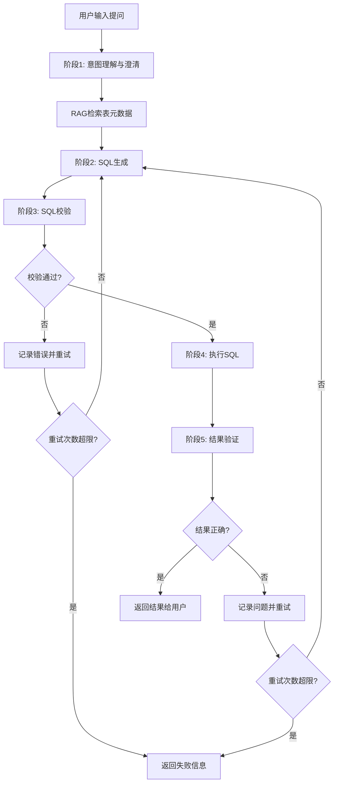
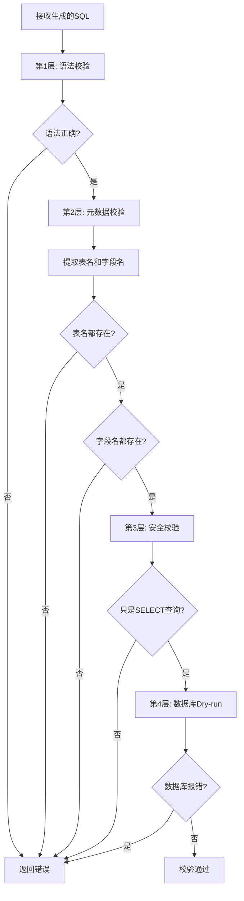

# 民航机场 ChatBI 智能商业分析系统 技术方案

---

## 文档信息

| 项目 | 内容 |
|------|------|
| 项目名称 | 民航机场 ChatBI 智能商业分析系统 |
| 文档版本 | V1.0 |
| 创建日期 | 2026-02-11 |
| 文档状态 | 初稿 |
| 目标读者 | 开发团队、技术团队、架构师 |

---

## 1. 项目概述

### 1.1 项目背景

民航机场日常运营涉及大量数据分析需求，包括航班运行数据、会员消费数据、商业经营数据、天气预警数据等（共41张业务表）。当前业务人员获取数据洞察主要依赖 IT 部门编写 SQL 查询，存在技术门槛高、响应周期长等痛点。

本项目旨在构建一个基于大语言模型的 Text2SQL 智能分析系统，通过自然语言交互方式，让业务人员无需掌握 SQL 即可快速获取数据洞察。

### 1.2 项目目标

| 目标维度 | 说明 |
|----------|------|
| 核心能力 | 自然语言 → SQL 查询 → 数据结果 |
| 准确率目标 | SQL 执行成功率 ≥ 85%，结果正确率 ≥ 80% |
| 性能目标 | 简单查询 ≤ 10 秒，复杂查询 ≤ 30 秒 |
| 用户规模 | 5-10 人（机场信息科技部） |

### 1.3 核心技术挑战

| 挑战 | 解决方案 |
|------|----------|
| 41张表中精准定位相关表 | RAG 多路召回 + 语义检索 |
| 自然语言到SQL的准确转换 | LLM + 自我反思循环（LangGraph） |
| 民航专业术语理解 | 业务术语词典 + 黄金SQL样例库 |
| 多表关联的复杂JOIN | 表关系元数据 + JOIN条件模板 |
| SQL安全控制 | 四层校验机制（语法+元数据+安全+Dry-run） |

---

## 2. 技术选型

### 2.1 核心框架层

| 技术 | 版本 | 选择理由 |
|------|------|----------|
| Python | 3.13+ | 最新稳定版，性能提升 10-15%，AI 生态最完善 |
| UV | latest | 比 pip 快 10-100 倍，内置虚拟环境管理 |
| LangGraph | 1.2+ | 专为复杂状态流设计，原生支持条件分支和循环 |

### 2.2 LLM 层

| 技术 | 版本 | 选择理由 |
|------|------|----------|
| Qwen3-30B-A3B | latest | MoE 架构，仅激活 3B 参数，显存需求 12-16GB，单卡 4090 可部署 |
| vLLM | 0.6+ | 推理速度快，比 transformers 快 20-30 倍，支持连续批处理 |
| transformers | 4.46+ | 备选方案，Hugging Face 官方库 |

**模型选择对比**：

| 模型 | 优点 | 缺点 | 是否选择 |
|------|------|------|----------|
| Qwen2.5-7B | 资源需求低 | SQL 生成能力可能不够 | ❌ |
| Qwen2.5-14B | 性价比高 | Dense 模型，显存需求较高 | 备选 |
| Qwen3-30B-A3B | 性价比最高，推理快 | 需要最新硬件支持 | ✅ 推荐 |
| Qwen3-235B-A22B | 性能最强 | 需要多卡，成本高 | ❌ |

### 2.3 数据库层

| 技术 | 版本 | 选择理由 |
|------|------|----------|
| MySQL/达梦 | 8.0+ | 目标数据库，民航领域常用 |
| SQLAlchemy | 2.0+ | 统一的数据库抽象层，支持多种数据库 |
| PyMySQL | 1.1+ | 纯 Python 实现，跨平台 |
| aiomysql | 0.2+ | 异步数据库操作，配合 FastAPI 异步特性 |

### 2.4 RAG 层

| 技术 | 版本 | 选择理由 |
|------|------|----------|
| Milvus | 0.5+ | 本地部署，数据不出域，轻量级，易于集成 |
| bge-large-zh | v1.5 | 中文 embedding 效果最好，可本地部署 |
| sentence-transformers | 3.3+ | 加载和使用 embedding 模型 |

### 2.5 SQL 处理层

| 技术 | 版本 | 选择理由 |
|------|------|----------|
| sqlglot | 25+ | 支持多种 SQL 方言，强大的 SQL 解析和转换能力 |

**sqlglot 核心能力**：
- SQL 语法树解析
- SQL 语法校验
- 提取表名和字段名
- SQL 格式化
- 方言转换（为达梦数据库预留）

### 2.6 应用层

| 技术 | 版本 | 选择理由 |
|------|------|----------|
| FastAPI | 0.115+ | 现代化异步 Web 框架，自动生成 API 文档 |
| Pydantic | 2.10+ | 强类型数据验证，自动生成 JSON Schema |
| Uvicorn | 0.32+ | ASGI 服务器，支持 HTTP/2 |

### 2.7 工具层

| 技术 | 版本 | 选择理由 |
|------|------|----------|
| loguru | 0.7+ | 比标准 logging 更好用，自动日志轮转 |
| python-dotenv | 1.0+ | 环境变量管理 |
| rich | 13+ | 美化终端输出 |

### 2.8 开发工具层

| 技术 | 版本 | 选择理由 |
|------|------|----------|
| pytest | 8.3+ | Python 标准测试框架 |
| ruff | 0.8+ | 极快的代码检查和格式化，替代 black、flake8、isort |
| mypy | 1.13+ | 静态类型检查 |

---

## 3. 系统设计方案

### 3.1 整体流程设计

系统采用五阶段循环流程，确保 SQL 生成的准确性：



### 3.2 阶段1：意图理解与澄清

#### 3.2.1 设计目标

判断用户意图是否明确，如果不明确则通过澄清问题收集必要信息。

#### 3.2.2 意图判断维度

| 维度 | 说明 | 示例 |
|------|------|------|
| 查询对象 | 是否明确要查询什么 | 航班/会员/订单/天气等 |
| 时间范围 | 是否指定了时间范围 | 2025年6月1日、过去30天 |
| 筛选条件 | 是否有足够的筛选条件 | 航班号CA1519、VIP会员 |
| 输出要求 | 是否明确要什么样的结果 | 详细信息、统计数量、排名TOP10 |

#### 3.2.3 意图分析 Prompt 模板

```python
INTENT_ANALYSIS_PROMPT = """
你是一个Text2SQL系统的意图分析专家。请分析用户问题是否包含生成SQL所需的完整信息。

用户问题：{user_question}

请按以下维度判断：

1. **查询对象**：是否明确要查询什么？（航班/会员/订单/天气等）
2. **时间范围**：是否指定了时间范围？
3. **筛选条件**：是否有足够的筛选条件？
4. **输出要求**：是否明确要什么样的结果？

请以JSON格式返回：
{
  "is_clear": true/false,
  "missing_elements": ["时间范围", "筛选条件"],
  "clarification_questions": [
    "您想查询哪一天的航班信息？"
  ]
}
"""
```

#### 3.2.4 澄清策略

| 策略 | 说明 | 示例 |
|------|------|------|
| 提供选项（推荐） | 提供2-4个常见选项 | "1.今天 2.最近一次 3.指定日期" |
| 引导式提问 | 逐项引导用户补充信息 | "请补充：1.查询哪些会员 2.时间范围" |
| 结合业务场景 | 根据民航业务特点提问 | "按航空公司统计？按航站楼统计？" |

#### 3.2.5 最大澄清轮次

建议设置 **2-3 轮**最大澄清次数，避免无限循环。

### 3.3 RAG 检索方案

#### 3.3.1 知识库分层架构

```
┌─────────────────────────────────────────────────────────────────┐
│                     五层知识库架构                               │
├─────────────────────────────────────────────────────────────────┤
│  Layer 1: 表级元数据                                             │
│  表名、表注释、业务描述、所属领域、关键词                         │
├─────────────────────────────────────────────────────────────────┤
│  Layer 2: 字段级元数据                                           │
│  字段名、字段类型、字段注释、枚举值、业务含义                     │
├─────────────────────────────────────────────────────────────────┤
│  Layer 3: 关系元数据                                             │
│  主外键关系、主子表关联、JOIN 条件                               │
├─────────────────────────────────────────────────────────────────┤
│  Layer 4: 业务术语词典                                           │
│  专业术语 → 字段/表映射、同义词、缩写词                           │
├─────────────────────────────────────────────────────────────────┤
│  Layer 5: 黄金 SQL 样例库                                        │
│  问题模板、对应SQL、查询模式分类                                 │
└─────────────────────────────────────────────────────────────────┘
```

#### 3.3.2 多路召回策略

| 通道 | 召回内容 | 方法 | 召回数量 |
|------|----------|------|----------|
| 通道1 | 表级召回 | Embedding 相似度匹配 | Top-5 表 |
| 通道2 | 字段召回 | 字段注释 + 业务含义匹配 | Top-15 字段 |
| 通道3 | 关系召回 | 图遍历查找关联关系 | 全部 JOIN 关系 |
| 通道4 | 术语召回 | 精确 + 模糊匹配 | 全部相关术语 |
| 通道5 | SQL样例召回 | 问题模板语义相似度 | Top-3 参考SQL |

#### 3.3.3 表级元数据结构

```json
{
  "table_name": "DW_OPT_FLIGHT",
  "table_comment": "航班信息表",
  "business_description": "存储航班的基本信息，包括航班号、起降机场、计划/实际时间、航班状态等核心数据",
  "domain": "航班数据",
  "keywords": ["航班", "航班号", "起飞", "降落", "延误", "航空公司"],
  "related_tables": ["DW_OPT_FLIGHT_GTDT", "DW_OPT_FLIGHT_CKDT", "DW_OPT_FLIGHT_DELY"],
  "common_queries": ["航班查询", "航班状态", "延误统计", "航班量统计"]
}
```

#### 3.3.4 字段级元数据结构

```json
{
  "table_name": "DW_OPT_FLIGHT",
  "column_name": "OPT_FP_MVIN",
  "column_type": "VARCHAR(1)",
  "column_comment": "运行标识：A - Arrival/到达，D - Departure/离港",
  "business_meaning": "标识航班是进港还是离港",
  "enum_values": [
    {"value": "A", "meaning": "到达/进港航班"},
    {"value": "D", "meaning": "离港/出发航班"}
  ],
  "synonyms": ["进出港", "到达离港", "进港离港", "航班方向"],
  "sample_values": ["A", "D"]
}
```

#### 3.3.5 业务术语词典结构

```json
{
  "term": "轮挡时间",
  "aliases": ["上轮挡", "下轮挡", "挡轮时间", "轮挡"],
  "definition": "飞机停稳后放置轮挡的时间（上轮挡）或撤除轮挡准备起飞的时间（下轮挡）",
  "related_tables": ["DW_OPT_FLIGHT_CHOT"],
  "related_columns": ["OPT_FS_AIBT", "OPT_FS_AOBT"],
  "domain": "航班运行"
}
```

#### 3.3.6 上下文长度控制

| 内容类型 | 建议数量 | Token 预估 |
|----------|----------|------------|
| 表元数据 | 最多 5 张表 | ~500 tokens |
| 字段元数据 | 最多 20 个字段 | ~800 tokens |
| 表关系 | 最多 5 个关系 | ~200 tokens |
| 术语解释 | 最多 5 个术语 | ~300 tokens |
| SQL 样例 | 最多 3 个样例 | ~600 tokens |
| **总计** | - | **~2400 tokens** |

### 3.4 阶段2：SQL 生成方案

#### 3.4.1 生成策略

使用 LangGraph 构建状态流，支持自我反思循环：

| 状态 | 说明 |
|------|------|
| 首次生成 | 基于 用户意图 + 表元数据 + 生成要求 |
| 重试生成 | 基于 用户意图 + 表元数据 + 上次SQL + 错误信息 + 修复指导 |

#### 3.4.2 Prompt 模板

```markdown
## 数据库 Schema 信息

### 相关表结构
{table_schemas}

### 字段说明
{column_descriptions}

### 表关系
{table_relations}

## 业务术语说明
{glossary}

## 参考 SQL 样例
{sql_examples}

## 用户问题
{user_question}

{error_context}

## 要求
请根据以上信息生成正确的 SQL 查询语句。
只返回 SQL 语句，不要有任何解释。
```

#### 3.4.3 重试控制

| 参数 | 建议值 | 说明 |
|------|--------|------|
| 最大重试次数 | 3-5 次 | 太少无法修复复杂问题，太多浪费时间 |
| 重试计数器 | 每次 +1 | 记录在状态中 |
| 错误信息传递 | 累积传递 | 每次重试包含历史错误 |

### 3.5 阶段3：SQL 校验方案

#### 3.5.1 四层校验机制



#### 3.5.2 各层校验详细说明

**第1层：语法校验**
- 使用 sqlglot 解析 SQL 语法树
- 检查基本语法错误

**第2层：元数据校验**
- 提取 SQL 中的表名，与知识库中的表名比对
- 提取 SQL 中的字段名，与对应表的字段名比对
- 确保所有引用的表和字段都存在

**第3层：安全校验**
- 确保只允许 SELECT 查询
- 拒绝 DROP、DELETE、UPDATE、INSERT、ALTER 等操作
- 拒绝注释注入（如 `--`、`/* */`）

**第4层：数据库 Dry-run**
- 使用 `EXPLAIN` 或 `LIMIT 0` 进行试执行
- 捕获数据库返回的错误信息
- 不实际返回任何数据

### 3.6 阶段4：SQL 执行方案

#### 3.6.1 执行流程

| 步骤 | 说明 | 关键点 |
|------|------|--------|
| 1. 获取连接 | 从连接池获取数据库连接 | 超时控制 |
| 2. 设置超时 | 建议设置 30-60 秒查询超时 | 防止慢查询 |
| 3. 执行SQL | 执行校验通过的 SQL | 捕获异常 |
| 4. 记录日志 | 记录 SQL、执行时间、返回行数 | 用于审计和分析 |

#### 3.6.2 结果对象结构

```python
{
    "sql": "SELECT ...",          # 执行的 SQL 语句
    "data": [...],                 # 查询结果数据
    "row_count": 100,              # 返回行数
    "execution_time": 1.5,         # 执行时间（秒）
    "success": true,               # 是否成功
    "error": None                  # 错误信息（如有）
}
```

### 3.7 阶段5：结果验证方案

#### 3.7.1 三层验证机制

| 层级 | 验证内容 | 方法 |
|------|----------|------|
| 第1层 | 执行错误检查 | 检查数据库是否报错 |
| 第2层 | 空结果处理 | 让 LLM 判断 0 行结果是否合理 |
| 第3层 | 语义验证 | 让 LLM 判断结果是否真正回答了用户问题 |

#### 3.7.2 语义验证 Prompt

```python
RESULT_VALIDATION_PROMPT = """
请验证以下查询结果是否正确回答了用户问题。

用户问题：{user_question}
生成的SQL：{sql}
查询结果：{result}
返回行数：{row_count}

请判断：
1. 查询结果是否真正回答了用户问题？
2. 如果返回0行，这是否是合理的结果？

请以JSON格式返回：
{
  "is_correct": true/false,
  "reason": "判断理由",
  "suggestions": "改进建议（如有问题）"
}
"""
```

---

## 4. 接口设计

### 4.1 API 接口列表

| 接口 | 方法 | 路径 | 说明 |
|------|------|------|------|
| 用户登录 | POST | /api/v1/auth/login | 用户认证 |
| 发起提问 | POST | /api/v1/chat/query | 核心问答接口 |
| 获取会话历史 | GET | /api/v1/chat/sessions | 获取会话列表 |
| 创建会话 | POST | /api/v1/chat/sessions | 创建新会话 |
| 删除会话 | DELETE | /api/v1/chat/sessions/{id} | 删除会话 |
| 获取收藏问题 | GET | /api/v1/favorites | 获取收藏列表 |
| 添加收藏 | POST | /api/v1/favorites | 收藏问题 |
| 上传文件 | POST | /api/v1/files/upload | 上传Excel/CSV |

### 4.2 核心接口设计

#### 4.2.1 发起提问接口

**请求**：
```http
POST /api/v1/chat/query
Content-Type: application/json

{
  "session_id": "uuid",
  "question": "查询航班号CA1519在2025年6月1日的详细信息",
  "stream": false
}
```

**响应**：
```json
{
  "code": 0,
  "message": "success",
  "data": {
    "answer": "根据查询结果...",
    "sql": "SELECT ...",
    "result": {
      "columns": ["航班号", "起飞时间", "目的地"],
      "rows": [["CA1519", "2025-06-01 08:00", "广州白云"]]
    },
    "chart": {
      "type": "table",
      "data": {...}
    },
    "execution_time": 1.5
  }
}
```

#### 4.2.2 流式响应接口

**请求**：
```http
POST /api/v1/chat/query
Content-Type: application/json

{
  "session_id": "uuid",
  "question": "查询延误航班统计",
  "stream": true
}
```

**响应**（Server-Sent Events）：
```
data: {"type": "thinking", "content": "正在分析您的问题..."}

data: {"type": "sql", "content": "SELECT ..."}

data: {"type": "result", "data": {...}}

data: {"type": "done", "execution_time": 2.3}
```

---

## 5. 数据模型设计

### 5.1 核心数据表

#### 5.1.1 会话表（chat_sessions）

| 字段 | 类型 | 说明 |
|------|------|------|
| id | UUID | 主键 |
| user_id | VARCHAR(50) | 用户ID |
| title | VARCHAR(200) | 会话标题 |
| created_at | TIMESTAMP | 创建时间 |
| updated_at | TIMESTAMP | 更新时间 |

#### 5.1.2 消息表（chat_messages）

| 字段 | 类型 | 说明 |
|------|------|------|
| id | UUID | 主键 |
| session_id | UUID | 会话ID（外键） |
| role | VARCHAR(20) | 角色：user/assistant/system |
| content | TEXT | 消息内容 |
| metadata | JSON | 元数据（SQL、执行时间等） |
| created_at | TIMESTAMP | 创建时间 |

#### 5.1.3 收藏表（user_favorites）

| 字段 | 类型 | 说明 |
|------|------|------|
| id | UUID | 主键 |
| user_id | VARCHAR(50) | 用户ID |
| question | TEXT | 问题内容 |
| category | VARCHAR(50) | 分类 |
| created_at | TIMESTAMP | 创建时间 |

#### 5.1.4 查询日志表（query_logs）

| 字段 | 类型 | 说明 |
|------|------|------|
| id | UUID | 主键 |
| user_id | VARCHAR(50) | 用户ID |
| question | TEXT | 用户问题 |
| generated_sql | TEXT | 生成的SQL |
| execution_time | FLOAT | 执行时间 |
| row_count | INT | 返回行数 |
| is_success | BOOLEAN | 是否成功 |
| error_message | TEXT | 错误信息 |
| created_at | TIMESTAMP | 创建时间 |

---

## 6. 开发计划

### 6.1 开发阶段划分

| 阶段 | 名称 | 周期 | 交付物 |
|------|------|------|--------|
| 第1阶段 | 基础框架搭建 | 1周 | 项目骨架、基础配置 |
| 第2阶段 | 元数据知识库构建 | 2周 | 41张表的元数据入库 |
| 第3阶段 | RAG检索模块 | 3周 | 多路召回功能 |
| 第4阶段 | SQL生成与校验 | 3周 | 核心Text2SQL流程 |
| 第5阶段 | API接口开发 | 2周 | RESTful API |
| 第6阶段 | 测试与优化 | 1周 | 单元测试、集成测试 |
|  |  |  |  |

### 6.2 功能优先级

| 优先级 | 功能模块 | 说明 |
|--------|----------|------|
| P0 | 意图理解、RAG检索、SQL生成、SQL校验、执行、结果验证 | MVP 核心功能 |
| P1 | 会话管理、收藏功能、文件上传 | 增强功能 |
| P2 | 知识库管理后台、移动端适配 | 扩展功能 |

---

## 7. 测试方案

### 7.1 测试策略

| 测试类型 | 覆盖范围 | 工具 |
|----------|----------|------|
| 单元测试 | 各模块函数 | pytest |
| 集成测试 | API 接口 | pytest + httpx |
| SQL准确率测试 | Text2SQL 核心能力 | 自建测试集 |
| 性能测试 | 响应时间、并发 | Locust |

### 7.2 SQL 生成测试集

基于 PRD 中的典型问题构建测试集：

| 序号 | 测试问题 | 预期SQL类型 | 复杂度 |
|------|----------|-------------|--------|
| 1 | 查询航班号CA1519在2025年6月1日的详细信息 | 单表精确查询 | 简单 |
| 2 | 统计过去30天内有过消费记录的活跃会员数量 | 聚合查询 | 中等 |
| 3 | 查询CA1519航班的登机门信息 | 多表JOIN | 中等 |
| 4 | 各航空公司航班量和准点率排名 | 分组聚合 | 复杂 |
| 5 | 找出2月份过生日的所有白名单会员 | 日期条件+筛选 | 中等 |

### 7.3 评估指标

| 指标 | 定义 | 目标值 |
|------|------|--------|
| 表召回准确率 | 正确召回相关表的比例 | ≥ 95% |
| 字段召回准确率 | 正确召回相关字段的比例 | ≥ 90% |
| SQL 执行成功率 | 生成的 SQL 可执行的比例 | ≥ 85% |
| SQL 结果正确率 | 返回正确结果的比例 | ≥ 80% |

---

## 8. 部署方案

### 8.1 部署架构

```
┌─────────────────────────────────────────────────────────────────┐
│                        应用服务器                                │
│  ┌─────────────┐  ┌─────────────┐  ┌─────────────┐             │
│  │   FastAPI   │  │   vLLM      │  │   Milvus    │             │
│  │   (Uvicorn) │  │   (Qwen3)   │  │   (向量库)  │             │
│  └─────────────┘  └─────────────┘  └─────────────┘             │
└─────────────────────────────────────────────────────────────────┘
                               │
                               ▼
┌─────────────────────────────────────────────────────────────────┐
│                      数据库服务器                                │
│  ┌─────────────┐  ┌─────────────┐                               │
│  │   MySQL     │  │  业务数据库  │                               │
│  │  (41张表)   │  │  (机场数据)  │                               │
│  └─────────────┘  └─────────────┘                               │
└─────────────────────────────────────────────────────────────────┘
```

### 8.2 部署步骤

1. **环境准备**：安装 Python 3.13、CUDA 驱动
2. **依赖安装**：使用 UV 安装项目依赖
3. **LLM模型**：由甲方提供
4. **数据库配置**：配置 MySQL 连接
5. **知识库初始化**：导入元数据到 Milvus
6. **启动服务**：启动 vLLM、FastAPI、Uvicorn
7. **健康检查**：验证各服务正常运行

---

## 9. 风险与应对

| 风险 | 影响 | 应对措施 |
|------|------|----------|
| Text-to-SQL 准确率不足 | 查询结果错误 | 增加 Few-shot 示例，持续优化 Prompt |
| LLM 响应延迟 | 用户体验差 | 引入缓存机制，优化 Prompt 长度 |
| 数据权限泄露 | 安全事故 | 严格权限校验，SQL 审计 |
| 专业术语理解偏差 | 查询意图误判 | 构建完善的术语库和同义词映射 |
| GPU 资源不足 | 无法部署模型 | 使用量化模型或多卡部署 |

---

## 10. 附录

### 10.1 完整依赖清单

```toml
[project]
name = "chatbi-aviation"
version = "0.1.0"
requires-python = ">=3.13"

dependencies = [
    # 核心框架
    "langgraph>=1.0.8",
    "langchain>=1.2.9",
    "langchain-community>=0.4.1",

    # LLM
    "vllm>=0.14.1",
    "transformers>=5.1.0",
    "torch>=2.10.0",

    # Web框架
    "fastapi>=0.128.5",
    "uvicorn[standard]>=0.40.0",
    "pydantic>=2.12.5",
    "pydantic-settings>=2.12.0",

    # 数据库
    "sqlalchemy>=2.0.46",
    "pymysql>=1.1.2",
    "aiomysql>=0.3.2",

    # RAG
    "chromadb>=1.4.1",
    "sentence-transformers>=5.2.2",

    # SQL处理
    "sqlglot>=28.10.0",

    # 工具
    "loguru>=0.7.3",
    "python-dotenv>=1.2.1",
    "rich>=14.3.2",

    # 测试
    "pytest>=9.0.2",
    "pytest-asyncio>=1.3.0",
    "httpx>=0.28.1",
]

[project.optional-dependencies]
dev = [
    "ruff>=0.15.0",
    "mypy>=1.19.1",
    "ipython>=9.10.0",
]

monitoring = [
    "langfuse>=3.13.0",
    "prometheus-client>=0.24.1",
]
```

### 10.2 术语表

| 术语 | 英文 | 解释 |
|------|------|------|
| ChatBI | Chat Business Intelligence | 基于对话的商业智能分析 |
| Text-to-SQL | - | 将自然语言转换为 SQL 查询语句的技术 |
| LLM | Large Language Model | 大语言模型 |
| RAG | Retrieval-Augmented Generation | 检索增强生成，结合知识库的 AI 问答技术 |
| MoE | Mixture of Experts | 混合专家模型，激活部分参数进行推理 |
| Dry-run | - | 试运行，不实际执行操作 |

---

**文档结束**
