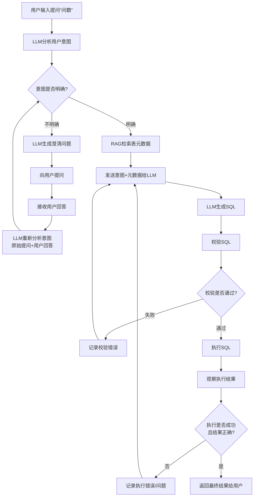
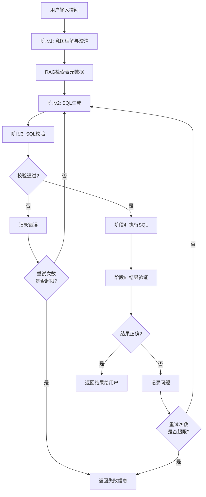
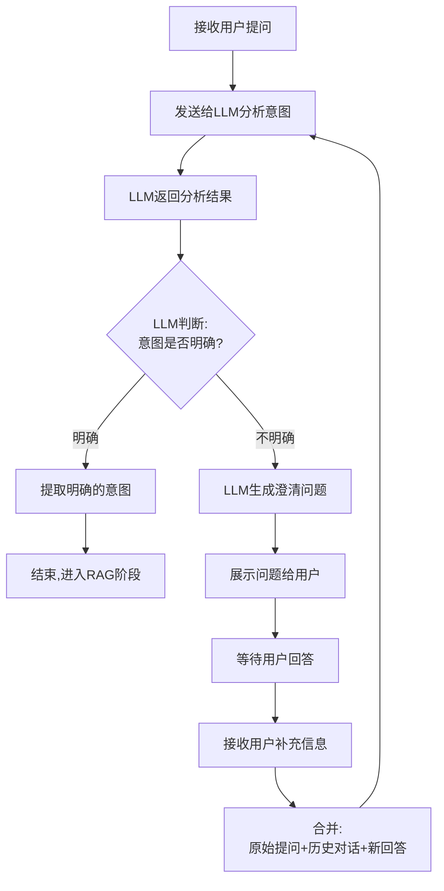
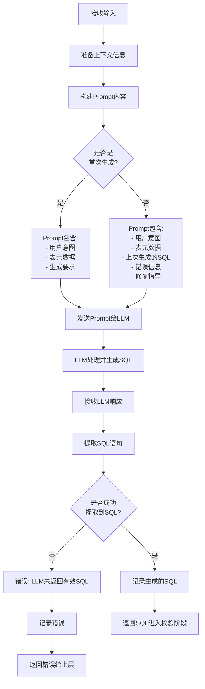
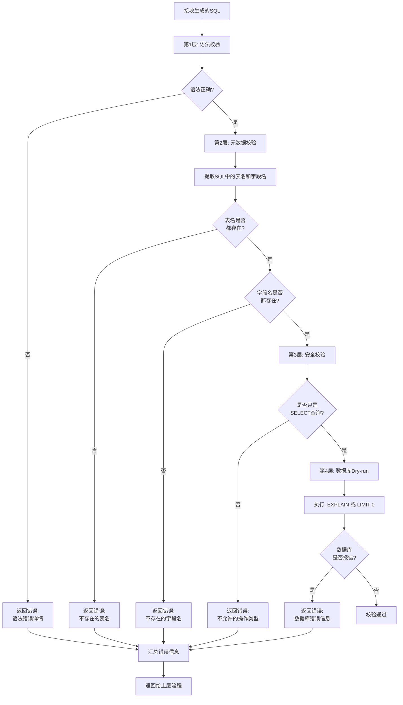
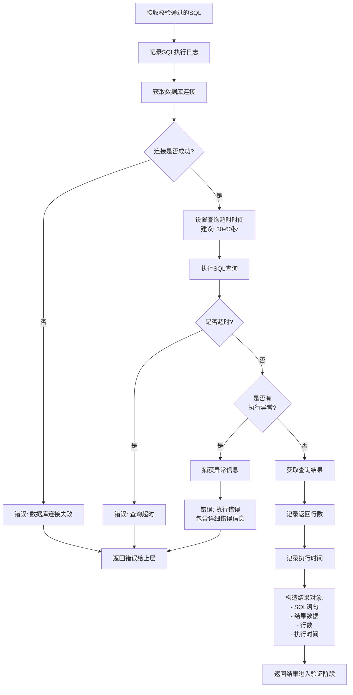
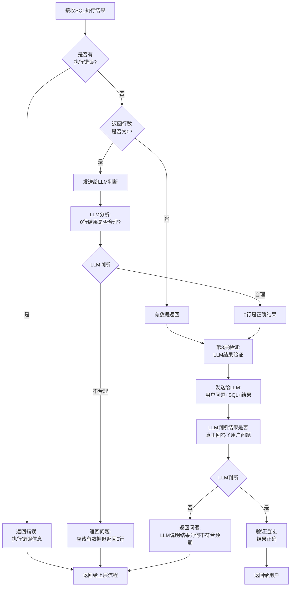
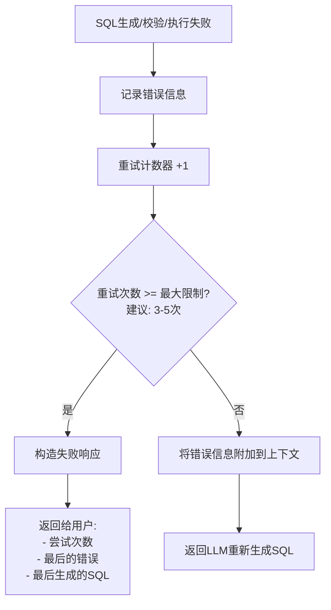
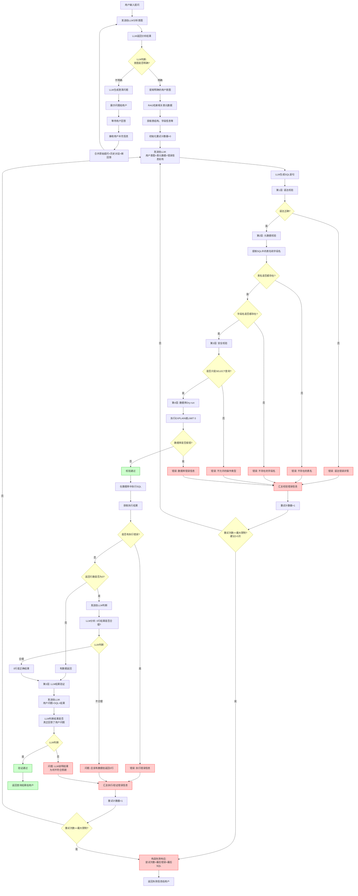

# 流程大全

从各种抽象程度分析核心流程，注意下面流程中没有包含“RAG检索表元数据” 节点的详细流程

# 综合流程

# 高抽象流程

# 阶段1：意图理解与澄清（详细）

  关键点：

  - LLM 需要返回两个信息：意图是否明确 + 澄清问题（如果不明确）

  - 保存对话历史，每次都把完整上下文发给 LLM

#   阶段2：SQL 生成（详细）

  关键点：

  - 首次生成和重试生成的 Prompt 不同

  - 重试时要包含上次的错误信息，帮助 LLM 修复

  - 需要从 LLM 响应中正确提取 SQL（可能需要解析 markdown 代码块）

# 阶段3：SQL 校验（详细）

  关键点：

  - 每层校验失败都要返回具体的错误信息，帮助 LLM 修复

  - 使用 EXPLAIN 或 LIMIT 0 进行 Dry-run，不实际返回数据

#   阶段4：执行 SQL（详细）

关键点：

+ 需要设置查询超时，防止慢查询
+ 要捕获所有可能的数据库异常
+ 记录执行时间和行数，用于后续分析
+ 返回的结果对象要包含完整信息

# 阶段5：结果验证（详细）

  关键点：

  - 第1层：检查执行错误（数据库报错）

  - 第2层：处理空结果（让 LLM 判断是否合理）

  - 第3层：LLM 深度验证（确保语义正确）

# 循环控制：重试次数限制

  建议的最大重试次数：3-5 次

  - 太少：可能无法修复复杂问题

  - 太多：浪费时间和成本，且可能陷入死循环

# 超详细版本

