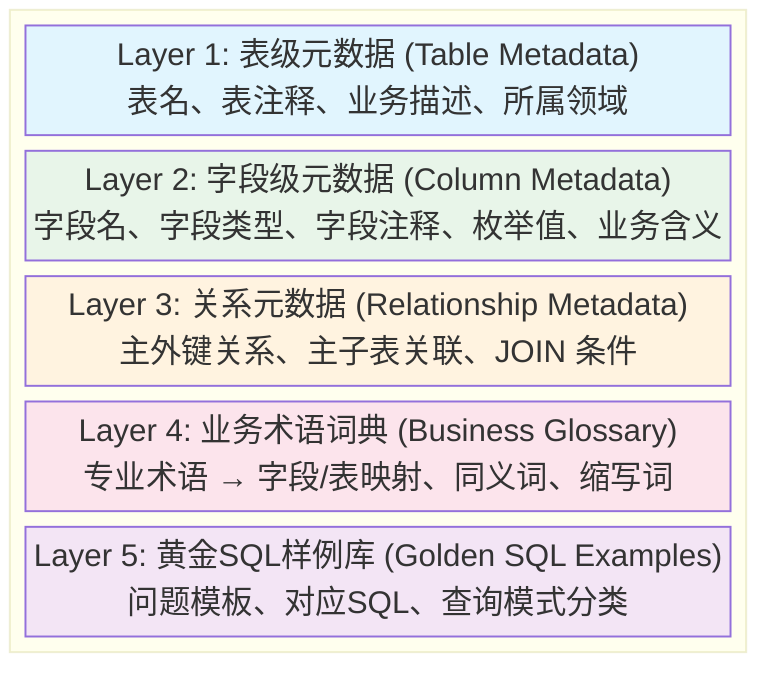
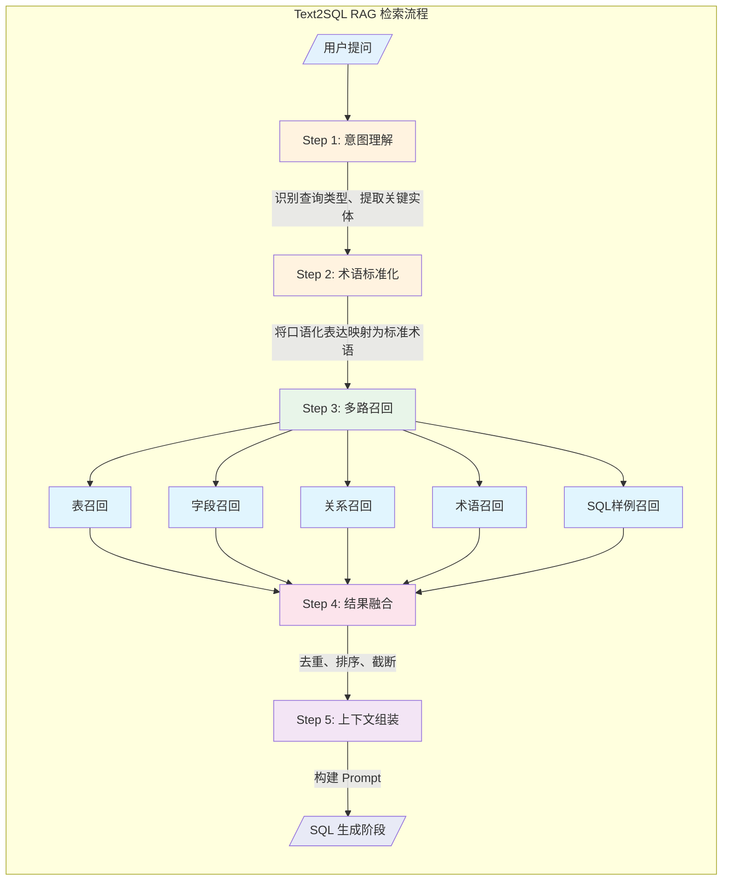
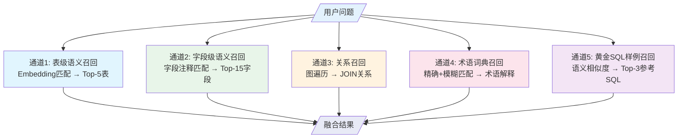
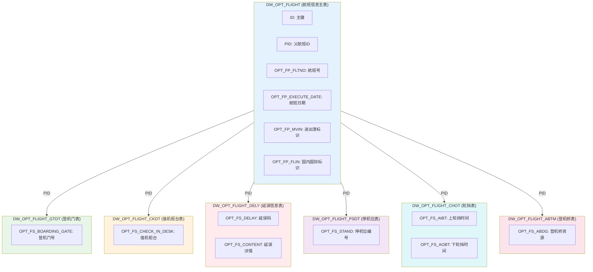
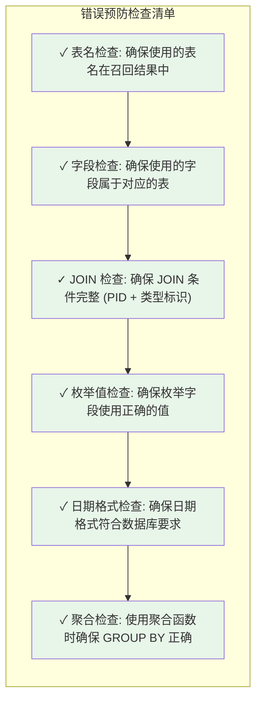

# Text2SQL 元数据检索设计文档

## 一、设计目标

在 Text2SQL 应用中，RAG（检索增强生成）阶段的核心目标是：**在用户提问后，精准检索出与问题相关的数据库元数据和参考信息，为 SQL 生成阶段提供充足的上下文**。

### 1.1 关键挑战

| 挑战 | 说明 |
|------|------|
| 表选择准确性 | 41张表中精准定位相关表 |
| 字段映射 | 将自然语言映射到正确的字段名 |
| 专业术语理解 | 理解民航领域专业术语（如"轮挡"、"CTOT"等） |
| 表关联关系 | 识别主子表关系，正确进行 JOIN |
| SQL 模式匹配 | 找到相似的历史 SQL 作为参考 |

---

## 二、元数据知识库构建

### 2.1 知识库分层架构



### 2.2 表级元数据结构设计

```json
{
  "table_name": "DW_OPT_FLIGHT",
  "table_comment": "航班信息表",
  "business_description": "存储航班的基本信息，包括航班号、起降机场、计划/实际时间、航班状态等核心数据",
  "domain": "航班数据",
  "keywords": ["航班", "航班号", "起飞", "降落", "延误", "航空公司"],
  "related_tables": ["DW_OPT_FLIGHT_GTDT", "DW_OPT_FLIGHT_CKDT", "DW_OPT_FLIGHT_DELY"],
  "common_queries": ["航班查询", "航班状态", "延误统计", "航班量统计"]
}
```

### 2.3 字段级元数据结构设计

```json
{
  "table_name": "DW_OPT_FLIGHT",
  "column_name": "OPT_FP_MVIN",
  "column_type": "VARCHAR(1)",
  "column_comment": "运行标识：A - Arrival/到达，D - Departure/离港",
  "business_meaning": "标识航班是进港还是离港",
  "enum_values": [
    {"value": "A", "meaning": "到达/进港航班"},
    {"value": "D", "meaning": "离港/出发航班"}
  ],
  "synonyms": ["进出港", "到达离港", "进港离港", "航班方向"],
  "sample_values": ["A", "D"]
}
```

### 2.4 表关系元数据结构设计

```json
{
  "relationship_id": "REL_001",
  "parent_table": "DW_OPT_FLIGHT",
  "child_table": "DW_OPT_FLIGHT_GTDT",
  "relationship_type": "one-to-many",
  "join_condition": "DW_OPT_FLIGHT.PID = DW_OPT_FLIGHT_GTDT.PID",
  "additional_condition": "DW_OPT_FLIGHT.OPT_FP_FLIN = DW_OPT_FLIGHT_GTDT.OPT_FS_GTYP",
  "description": "航班主表与登机门子表的关联，需要同时匹配PID和国内国际标识"
}
```

### 2.5 业务术语词典结构设计

```json
{
  "term": "轮挡时间",
  "aliases": ["上轮挡", "下轮挡", "挡轮时间", "轮挡"],
  "definition": "飞机停稳后放置轮挡的时间（上轮挡）或撤除轮挡准备起飞的时间（下轮挡）",
  "related_tables": ["DW_OPT_FLIGHT_CHOT"],
  "related_columns": ["OPT_FS_AIBT", "OPT_FS_AOBT"],
  "domain": "航班运行"
}
```

### 2.6 黄金 SQL 样例结构设计

```json
{
  "example_id": "SQL_001",
  "question_template": "查询{航班号}在{日期}的详细信息",
  "question_examples": [
    "查询CA1519在2025年6月1日的航班信息",
    "我想看看MU5101今天的航班详情"
  ],
  "sql_template": "SELECT ... FROM DW_OPT_FLIGHT WHERE OPT_FP_FLTNO = ? AND OPT_FP_EXECUTE_DATE = ?",
  "query_pattern": "单表精确查询",
  "involved_tables": ["DW_OPT_FLIGHT"],
  "key_columns": ["OPT_FP_FLTNO", "OPT_FP_EXECUTE_DATE"],
  "complexity": "simple"
}
```

---

## 三、RAG 检索流程设计

### 3.1 整体流程架构



### 3.2 Step 1: 意图理解

#### 3.2.1 查询类型分类

| 类型 | 说明 | 示例 |
|------|------|------|
| 精确查询 | 根据具体条件查询特定记录 | "查询CA1519航班信息" |
| 统计聚合 | COUNT/SUM/AVG 等聚合操作 | "统计今天的国际航班数量" |
| 排名分析 | TOP N、排序类查询 | "航空公司航班量排名" |
| 时间范围 | 涉及时间段的查询 | "最近30天的延误航班" |
| 多表关联 | 需要 JOIN 多表的查询 | "查询航班的登机门信息" |
| 比较计算 | 涉及字段间计算比较 | "计划与实际起飞时间差" |

#### 3.2.2 实体提取

从用户问题中提取以下关键实体：

```python
# 实体提取示例
entities = {
    "flight_no": "CA1519",           # 航班号
    "date": "2025-06-01",            # 日期
    "airport": "PEK",                # 机场代码
    "airline": "CA",                 # 航空公司
    "status": "延误",                # 航班状态
    "direction": "离港",             # 进出港方向
    "time_range": "最近30天",        # 时间范围
    "aggregation": "COUNT",          # 聚合类型
    "limit": 10                      # 数量限制
}
```

### 3.3 Step 2: 术语标准化

#### 3.3.1 术语映射规则

将用户口语化表达映射为数据库标准术语：

| 用户表达 | 标准术语 | 对应字段 |
|----------|----------|----------|
| "起飞时间" | 计划起飞时间/实际起飞时间 | OPT_FP_SOBT / OPT_FS_ATOT |
| "降落时间" | 计划到达时间/实际到达时间 | OPT_FP_SIBT / OPT_FS_ALDT |
| "出发航班" | 离港航班 | OPT_FP_MVIN = 'D' |
| "到达航班" | 进港航班 | OPT_FP_MVIN = 'A' |
| "国际航班" | 国际航班 | OPT_FP_FLIN = 'I' |
| "国内航班" | 国内航班 | OPT_FP_FLIN = 'D' |
| "登机口" | 登机门 | OPT_FS_BOARDING_GATE |
| "柜台" | 值机柜台 | OPT_FS_CHECK_IN_DESK |

#### 3.3.2 缩写词展开

| 缩写 | 全称 | 含义 |
|------|------|------|
| SOBT | Scheduled Off-Block Time | 计划起飞时间 |
| SIBT | Scheduled In-Block Time | 计划到达时间 |
| ATOT | Actual Take-Off Time | 实际起飞时间 |
| ALDT | Actual Landing Time | 实际到达时间 |
| CTOT | Calculated Take-Off Time | 预计起飞时间 |
| ELDT | Estimated Landing Time | 预计到达时间 |

### 3.4 Step 3: 多路召回策略

#### 3.4.1 召回通道设计



**各通道详细说明：**

| 通道 | 输入 | 方法 | 召回数量 | 输出 |
|------|------|------|----------|------|
| 通道1: 表级召回 | 用户问题 + 提取实体 | Embedding 相似度匹配 | Top-5 | 表名 + 表注释 + 相关度分数 |
| 通道2: 字段召回 | 问题中的关键词 | 字段注释 + 业务含义匹配 | Top-15 | 表名.字段名 + 字段注释 + 枚举值 |
| 通道3: 关系召回 | 通道1召回的表列表 | 图遍历查找关联关系 | 全部 | JOIN 条件 + 关系描述 |
| 通道4: 术语召回 | 问题中的专业术语 | 精确匹配 + 模糊匹配 | 全部 | 术语解释 + 关联表/字段 |
| 通道5: SQL样例召回 | 用户问题 | 问题模板语义相似度 | Top-3 | 参考问题 + 参考SQL + 查询模式 |

#### 3.4.2 Embedding 模型选择建议

| 模型 | 特点 | 适用场景 |
|------|------|----------|
| text-embedding-3-small | 轻量、快速 | 表级召回 |
| text-embedding-3-large | 精度高 | 字段级召回、SQL样例召回 |
| bge-large-zh | 中文优化 | 术语词典召回 |
| m3e-base | 中文通用 | 通用场景 |

### 3.5 Step 4: 结果融合与排序

#### 3.5.1 融合策略

```python
def merge_recall_results(table_results, column_results, relation_results,
                         glossary_results, sql_examples):
    """
    融合多路召回结果
    """
    merged = {
        "tables": [],           # 相关表列表
        "columns": [],          # 相关字段列表
        "relations": [],        # 表关系列表
        "glossary": [],         # 术语解释
        "sql_examples": []      # 参考SQL
    }

    # 1. 表去重与排序（按相关度分数）
    seen_tables = set()
    for table in sorted(table_results, key=lambda x: x['score'], reverse=True):
        if table['name'] not in seen_tables:
            merged['tables'].append(table)
            seen_tables.add(table['name'])

    # 2. 字段过滤（只保留已召回表的字段）
    for col in column_results:
        if col['table'] in seen_tables:
            merged['columns'].append(col)

    # 3. 关系补全（确保召回表之间的关系完整）
    for rel in relation_results:
        if rel['parent'] in seen_tables or rel['child'] in seen_tables:
            merged['relations'].append(rel)

    # 4. 术语和SQL样例直接添加
    merged['glossary'] = glossary_results
    merged['sql_examples'] = sql_examples[:3]  # 最多3个样例

    return merged
```

#### 3.5.2 上下文长度控制

| 内容类型 | 建议数量 | Token 预估 |
|----------|----------|------------|
| 表元数据 | 最多 5 张表 | ~500 tokens |
| 字段元数据 | 最多 20 个字段 | ~800 tokens |
| 表关系 | 最多 5 个关系 | ~200 tokens |
| 术语解释 | 最多 5 个术语 | ~300 tokens |
| SQL 样例 | 最多 3 个样例 | ~600 tokens |
| **总计** | - | **~2400 tokens** |

**32k Token 大约相当于：**

- **中文**：约 **2 万至 3 万个汉字**。
- **英文**：约 **2万4千个单词**。

### 3.6 Step 5: 上下文组装（Prompt 构建）

#### 3.6.1 Prompt 模板结构

```markdown
## 数据库 Schema 信息

### 相关表结构
{table_schemas}

### 字段说明
{column_descriptions}

### 表关系
{table_relations}

## 业务术语说明
{glossary}

## 参考 SQL 样例
{sql_examples}

## 用户问题
{user_question}

## 要求
请根据以上信息生成正确的 SQL 查询语句。
```

#### 3.6.2 完整 Prompt 示例

以用户问题 **"查询CA1519在2025年6月1日的登机门信息"** 为例：

```markdown
## 数据库 Schema 信息

### 相关表结构

**表1: DW_OPT_FLIGHT（航班信息表）**
- ID: BIGINT - 主键
- PID: BIGINT - 父航班ID
- OPT_FP_FLTNO: VARCHAR(12) - 航班号
- OPT_FP_EXECUTE_DATE: DATE - 航班日期
- OPT_FP_FLIN: VARCHAR(1) - 航班标识（I国际、D国内）

**表2: DW_OPT_FLIGHT_GTDT（登机门表）**
- ID: BIGINT - 主键
- PID: BIGINT - 父航班ID
- OPT_FS_BOARDING_GATE: VARCHAR(8) - 登机门号
- OPT_FS_GTYP: VARCHAR(1) - 登机门资源国内国际标识

### 表关系
- DW_OPT_FLIGHT 与 DW_OPT_FLIGHT_GTDT 通过 PID 关联
- 额外条件: DW_OPT_FLIGHT.OPT_FP_FLIN = DW_OPT_FLIGHT_GTDT.OPT_FS_GTYP

## 参考 SQL 样例

**问题**: 查询航班登机门信息
```sql
SELECT a.OPT_FS_BOARDING_GATE
FROM DW_OPT_FLIGHT t
LEFT JOIN DW_OPT_FLIGHT_GTDT a ON t.PID = a.PID AND t.OPT_FP_FLIN = a.OPT_FS_GTYP
WHERE t.OPT_FP_EXECUTE_DATE = DATE_FORMAT('2025-06-01', '%Y-%m-%d')
  AND t.OPT_FP_FLTNO = 'CA3576'
```

## 用户问题
查询CA1519在2025年6月1日的登机门信息

## 要求
请根据以上信息生成正确的 SQL 查询语句。

---

## 四、针对多表关联的特殊优化

### 4.1 例：航班数据表关系图



**表关系说明：**
- 主表 `DW_OPT_FLIGHT` 通过 `PID` 字段与所有子表关联
- 关联时需要额外匹配国内国际标识（如 `OPT_FP_FLIN = OPT_FS_GTYP`）

### 4.2 常见查询模式识别

| 模式ID | 查询模式 | 涉及表 | 关键字段 |
|--------|----------|--------|----------|
| P001 | 航班基本信息查询 | DW_OPT_FLIGHT | OPT_FP_FLTNO, OPT_FP_EXECUTE_DATE |
| P002 | 航班+登机门查询 | DW_OPT_FLIGHT + _GTDT | PID, OPT_FS_BOARDING_GATE |
| P003 | 航班+值机柜台查询 | DW_OPT_FLIGHT + _CKDT | PID, OPT_FS_CHECK_IN_DESK |
| P004 | 航班延误分析 | DW_OPT_FLIGHT + _DELY | OPT_FS_STATUS, OPT_FS_DELAY |
| P005 | 航班统计聚合 | DW_OPT_FLIGHT | COUNT, GROUP BY |
| P006 | 时间差计算 | DW_OPT_FLIGHT | OPT_FP_SOBT, OPT_FS_ATOT |

### 4.3 关键字段枚举值速查

#### OPT_FP_MVIN（进出港标识）
| 值 | 含义 | 常见表达 |
|----|------|----------|
| A | 到达/进港 | 到达航班、进港航班、降落 |
| D | 离港/出发 | 出发航班、离港航班、起飞 |

#### OPT_FP_FLIN（国内国际标识）
| 值 | 含义 | 常见表达 |
|----|------|----------|
| I | 国际航班 | 国际、International |
| D | 国内航班 | 国内、Domestic |

#### OPT_FS_STATUS（航班状态）
| 值 | 含义 |
|----|------|
| 正常 | 航班正常运行 |
| 延误 | 航班延误 |
| 取消 | 航班取消 |
| 备降 | 航班备降 |

---

## 五、提升 SQL 生成准确率的策略

### 5.1 召回质量保障

| 策略 | 说明 | 预期效果 |
|------|------|----------|
| 多路召回 | 并行检索多个知识库 | 提高召回率 |
| 语义+关键词混合 | 结合语义匹配和关键词匹配 | 平衡精确性和泛化性 |
| 动态 Top-K | 根据问题复杂度调整召回数量 | 优化上下文利用率 |
| 关系补全 | 自动补充召回表之间的关系 | 确保 JOIN 正确性 |

### 5.2 上下文质量保障

| 策略 | 说明 | 预期效果 |
|------|------|----------|
| 字段精简 | 只保留相关字段，不输出全部字段 | 减少噪音 |
| 枚举值注入 | 对枚举字段提供可选值 | 避免值错误 |
| SQL 样例引导 | 提供相似查询的参考 SQL | 提供模式参考 |
| 术语解释 | 解释专业术语含义 | 消除歧义 |

### 5.3 错误预防机制



---

## 六、 评估指标

| 指标 | 定义 | 目标值 |
|------|------|--------|
| 表召回准确率 | 正确召回相关表的比例 | ≥ 95% |
| 字段召回准确率 | 正确召回相关字段的比例 | ≥ 90% |
| SQL 执行成功率 | 生成的 SQL 可执行的比例 | ≥ 85% |
| SQL 结果正确率 | 返回正确结果的比例 | ≥ 80% |

---

## 七、总结

本文档设计了一套完整的 Text2SQL RAG 检索流程，核心要点如下：

1. **五层知识库架构**：表元数据、字段元数据、关系元数据、业务术语、黄金SQL样例
2. **五步检索流程**：意图理解 → 术语标准化 → 多路召回 → 结果融合 → 上下文组装
3. **多路召回策略**：表级召回、字段级召回、关系召回、术语召回、SQL样例召回
4. **航班数据特殊优化**：主子表关系处理、枚举值映射、常见查询模式识别

通过这套流程，可以在用户提问后快速检索到相关的数据库元数据和参考信息，为 SQL 生成阶段提供充足的上下文，从而提高 SQL 生成的准确率。


